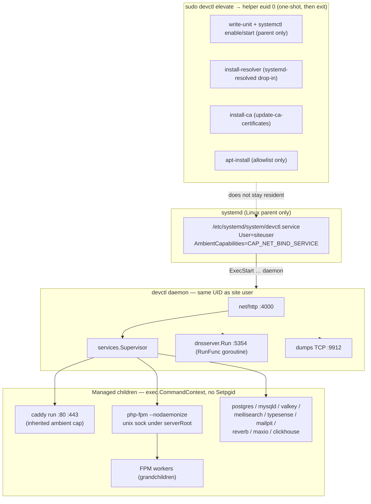

# How Linux runtime works (explainer)

Source: how explainer adba9215-225d-4d5a-9481-9b92a74f88b3. Verified against Go source. Supervisor comments say SIGTERM. Code sends SIGKILL.

### Overview

devctl is a non-root parent process. systemd starts only that parent. The parent starts, watches, and stops every catalog service as a child (`exec.CommandContext`) or as an in-process goroutine (DNS).

Installers put binaries under `{serverRoot}/<id>/`. They do not install the services with APT. APT installs only small libraries and a compiler for pgvector. Privileged OS work (unit file, DNS drop-in, CA trust, apt allowlist) is a root one-shot: `sudo devctl elevate` then `devctl helper <op>`.

The Linux-only seams are: systemd (parent + resolved), `CAP_NET_BIND_SERVICE` for `:80`/`:443`, hardcoded `linux-amd64` / `-linux-x86_64` download URLs, `dpkg-deb` / `lsb_release` / ELF checks, `update-ca-certificates`, `/home/` and `/etc/systemd/` paths. There are no `GOOS` files and no `runtime.GOOS` in Go source.

### Key Concepts

- **Parent vs children.** `elevate.BuildServiceFile` writes `/etc/systemd/system/devctl.service` with `User=<site user>`, `ExecStart=… daemon`, `AmbientCapabilities=CAP_NET_BIND_SERVICE`, `CapabilityBoundingSet=CAP_NET_BIND_SERVICE`, `NoNewPrivileges=true`. The unit does not set `KillMode`, so systemd uses the default `control-group`.
- **Daemon refuses root.** `main.run()` exits if `os.Geteuid() == 0`.
- **Managed children.** Every entry in `config.DefaultServices` has `Managed: true`. PHP-FPM is added at runtime as `php-fpm-{ver}` with `--nodaemonize`. DNS uses `Definition.RunFunc` (no exec).
- **Dead systemctl branch for catalog services.** `services.Manager` still has a shell `Start`/`Stop`/`Status` path when `Managed == false`. Nothing in defaults uses it. `install.enableAndStart` / `stopAndDisable` have no callers. `systemctl enable` is used only for the parent unit (`elevate.helperSystemctl` allowlists `devctl` and `systemd-resolved`).
- **Paths.** Owned files come from `DEVCTL_SERVER_ROOT` through the `paths` package. Fallback is `{home}/ddev/sites/server` (`config.resolveServerRoot`).

### How It Works

**1. Start the parent**

`sudo devctl elevate ports` (or `elevate install`) calls `helper write-unit`, then `helper systemctl daemon-reload`, `enable`, `restart`. The child of systemd is `devctl daemon`. Ambient `CAP_NET_BIND_SERVICE` is inherited by children, so Caddy can bind `:80` and `:443` without `setcap` on the Caddy binary.

**2. `run()` wiring (`main.go`)**

1. Load config and SQLite.
2. Refresh PHP prepend + FPM configs; run `install.Ensure*` for service config files.
3. Build `services.Registry` from `config.DefaultServices`.
4. Register each installed PHP version with `phpFPMDefinition`.
5. Auto-install Caddy if missing (skipped when `DEVCTL_TESTING` is set).
6. Auto-start Caddy, wait for Admin API `http://localhost:2019`, then `sites.CaddyClient.EnsureHTTPServer`.
7. Auto-start remaining installed catalog services and PHP-FPM.
8. Start poller, supervisor loop, site watcher, dump TCP listener (`:9912`), update checkers.
9. Listen on `devctl_host`:`devctl_port` (default `127.0.0.1:4000`).

**3. Supervise children (`services/supervisor.go`)**

`Supervisor.Start` forks with `exec.CommandContext`. It does not set `SysProcAttr.Setpgid`. `ManagedUser` sets `Credential` only if the UID differs from the daemon; with the current unit that branch is a no-op (daemon already is the site user, and `CapabilityBoundingSet` has no `CAP_SETUID`).

ClickHouse sets `CLICKHOUSE_WATCHDOG_ENABLE=0` via `clickhouse.env` so it does not double-fork. PHP-FPM stays in the foreground (`--nodaemonize`). FPM workers are grandchildren.

Stop path:

1. `cancel()` on the `CommandContext`.
2. Wait up to 10 s on the `done` channel, then `cmd.Process.Kill()`.

Contradiction with comments: `Stop` comments say SIGTERM. Go’s default `CommandContext` cancel is `Process.Kill()` = SIGKILL on Unix. The 10 s grace wait runs after SIGKILL of the direct child. No process-group kill, so FPM workers can remain.

`Supervisor.Run` restarts crashed children every 2 s. On `ctx.Done()` it calls `stopAll`. `main.run()` does not wait for `stopAll` after HTTP shutdown. `api.Server.Listen` returns when the HTTP server stops (5 s `Shutdown`). Children can still be running when the parent exits; systemd then kills the cgroup.

**4. Re-exec (same PID)**

`internal/reexec.Now` uses `syscall.Exec`. `api.handleRestart` passes `nil` AfterStop. Self-update AfterStop only refreshes CLI tools. Children are not stopped. They keep the same parent PID. The new image has an empty `procs` map and then auto-starts again (bind conflicts).

**5. Install (binaries under server root)**

`install.NewRegistry` maps id → installer. Pattern: download → extract into `paths.ServiceDir` → symlink into `paths.BinDir` → supervisor start. Reverb is a Composer Laravel app, not a vendor binary. DNS `IsInstalled()` always returns true.

APT leftovers (need root via `sudo devctl elevate install` / `aptInstallW`):

| Package | Caller |
|---|---|
| `libreadline-dev` | `install/postgres.go` |
| `libnuma1` | `install/mysql.go` |
| `build-essential` | `install/pgext_pgvector.go` (`make`) |
| `libnss3-tools` | allowlisted in `elevate/helper.go`; UI path in `api/tls.go` is dead |

MySQL and Timescale/pg_clickhouse use `dpkg-deb --extract` on Ubuntu `.deb` files. Valkey picks jammy/noble via `lsb_release -cs`. ClickHouse `IsInstalled` requires ELF magic `0x7f ELF` (`isClickHouseBinaryOK`). PHP assets match only suffix `-linux-x86_64` (`php.parsePHPBinaryAssetName`). `runtime.GOARCH` is used only for Percona/Timescale/pg_clickhouse arch tokens. `runtime.GOOS` is unused.

`php.disableSystemFPM` still runs `systemctl stop/disable php{ver}-fpm.service` (distro unit, errors ignored). That is not how devctl FPM is supervised. Socket path is `{serverRoot}/php/{ver}/php-fpm.sock` (`php.FPMSocket`).

**6. Network**

- Caddy child: `EnsureHTTPServer` PUTs Admin API JSON (no Caddyfile). Listen `:80` and `:443` (all interfaces). TLS automation `issuers: [{module: "internal"}]` for `*.test`. `caddy.env` sets `HOME={caddyDir}` so the internal CA lives under server root. Admin API is Caddy default `localhost:2019`.
- FastCGI: Caddy `unix/` + `php.FPMSocket`.
- In-process DNS: bind `":"+port` (default 5354, all interfaces). A records = `DetectLANIP()` (UDP dial to `8.8.8.8:80`). Upstream from `/run/systemd/resolve/resolv.conf` then `/etc/resolv.conf`, skip `127.0.0.53`.
- Resolver (root): drop-in `/etc/systemd/resolved.conf.d/99-devctl-dns.conf` with `DNS=127.0.0.1:5354` and `Domains=~test`. Skip if resolved is missing. No `/etc/resolver`, no pf, no nft, no `/etc/hosts`.
- CA (root): write `/usr/local/share/ca-certificates/devctl-local-ca.crt`, run `update-ca-certificates` (or RHEL `update-ca-trust`). Elevate trust does not update NSS.
- Dashboard TLS API: `POST /api/tls/trust` always 403 on the live daemon (`handleTLSTrust` → `writeNeedsElevation` because euid ≠ 0). The apt-get/NSS body in that handler never runs.
- Dump TCP: `":"+dump_tcp_port` (default 9912, all interfaces). Dashboard HTTP is loopback by default.

### Where Things Live

| Item | Path / symbol |
|---|---|
| Unit | `/etc/systemd/system/devctl.service` — `elevate.ServiceUnitPath`, `BuildServiceFile` |
| DB | `{serverRoot}/devctl/devctl.db` — `paths.DBPath` |
| Service data | `{serverRoot}/<id>/` — `paths.ServiceDir` |
| PATH farm | `{serverRoot}/bin` — `paths.BinDir` |
| Logs | `{serverRoot}/logs/<id>.log` |
| PHP | `{serverRoot}/php/{ver}/` — `php.PHPDir`; FPM sock `php-fpm.sock` |
| Caddy CA HOME | `{serverRoot}/caddy/` via `EnsureCaddyEnv` |
| Resolved drop-in | `/etc/systemd/resolved.conf.d/99-devctl-dns.conf` |
| System CA | `/usr/local/share/ca-certificates/devctl-local-ca.crt` |
| Catalog defs | `config/defaults.go` |
| Supervisor | `services/supervisor.go` |
| Installer iface | `install/install.go` (`enableAndStart` unused) |
| Helper ops | `elevate/helper.go` `RunHelper` |
| Caddy JSON | `sites/caddy.go` `EnsureHTTPServer` |
| PHP asset names | `php/releases.go` `parsePHPBinaryAssetName` |
| Open browser | `open.go` — reads unit file, calls `xdg-open` |

### Gotchas

Stop signal comments are wrong. Treat cancel as SIGKILL of the direct child only. No process group. FPM workers and any other grandchild can survive `Stop`. ClickHouse watchdog is already disabled for this reason. FPM is not grouped.

systemd owns only the parent. `install.enableAndStart` is dead. Catalog services are never `systemctl enable`'d. The one live `systemctl enable` is the parent (`elevate/orchestrate.go`). `php.disableSystemFPM` still talks to distro FPM units.

Re-exec does not stop children. Restart and self-update replace the process image in place. Auto-start then races the old children.

Shutdown does not join `stopAll`. HTTP shutdown can finish while supervisor stop is still running. systemd cgroup kill is the backup path. That backup does not exist on a LaunchAgent analog unless you add it.

`ManagedUser` / Credential drop is unused under the current unit. Comments in `Definition` still describe a root daemon.

Installer comments are stale. `Installer.Install` still says “adds APT source … enables + starts”. Behavior is tarball/deb extract + supervisor.

Hardcoded Linux/amd64 downloads (must branch for Darwin): Caddy, Mailpit, Meilisearch, Typesense, MaxIO, ClickHouse plus ELF IsInstalled, MySQL debs, Valkey jammy/noble, PHP `-linux-x86_64`, tools, self-update single `devctl` asset.

Postgres is the exception: Percona URL uses `linux-{x86_64|aarch64}` from `GOARCH`, plus Timescale/pg_clickhouse `.deb` extract and source `make` for pgvector.

Linux-only OS seams: systemd parent, ambient bind cap, Caddy `:80`/`:443`, resolved drop-in, update-ca-certificates, helper ops, `xdg-open`, `/home/` in skill path, Makefile `getent`, tests Incus-only, ClickHouse ELF, APT/dpkg/lsb_release.
