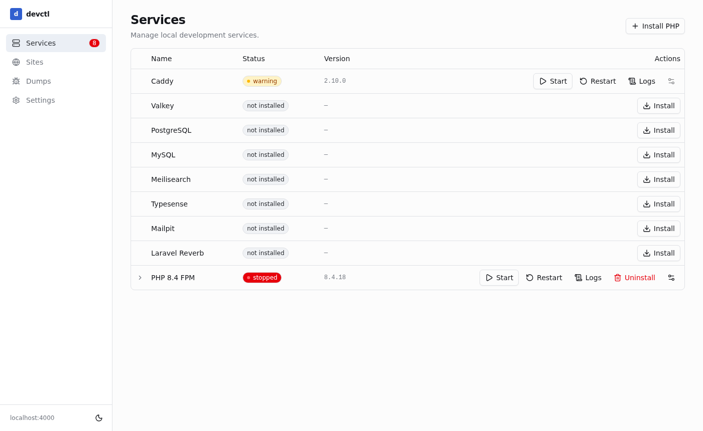
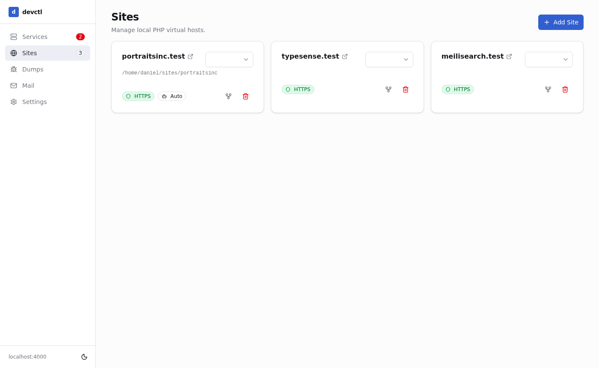
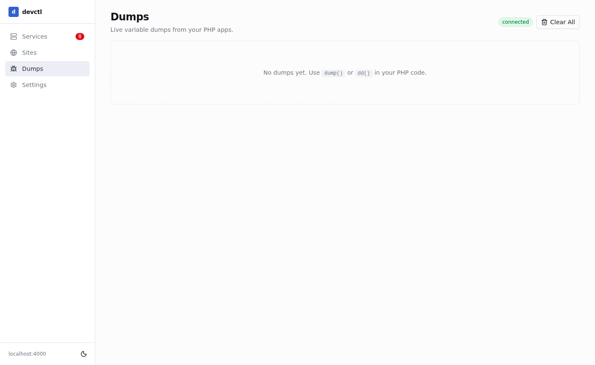
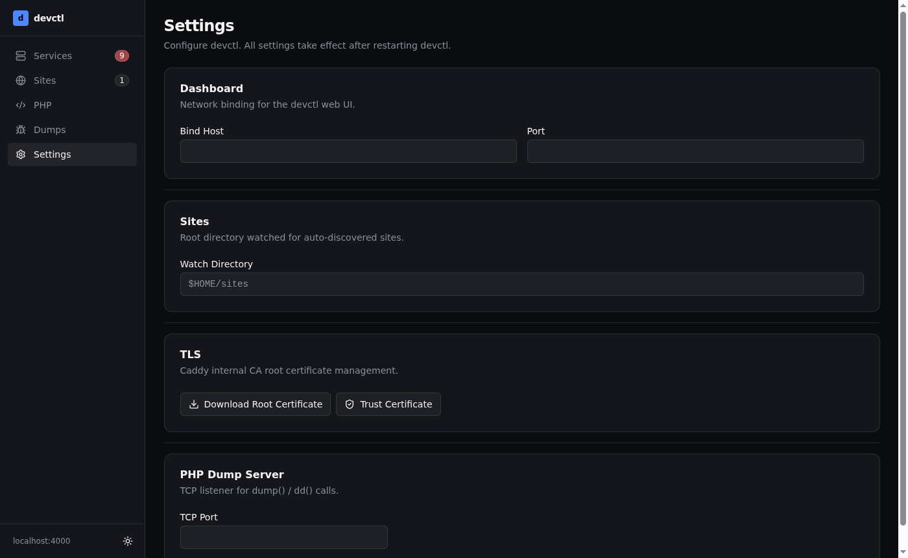
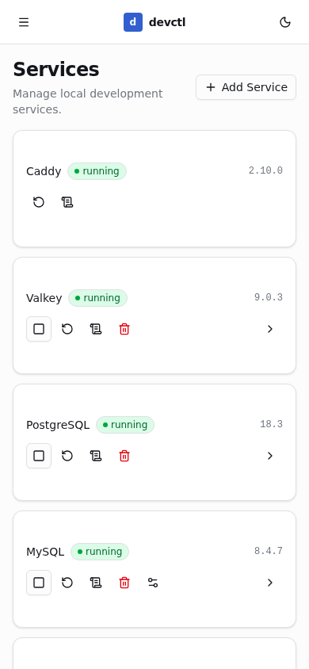
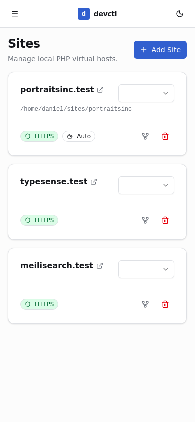
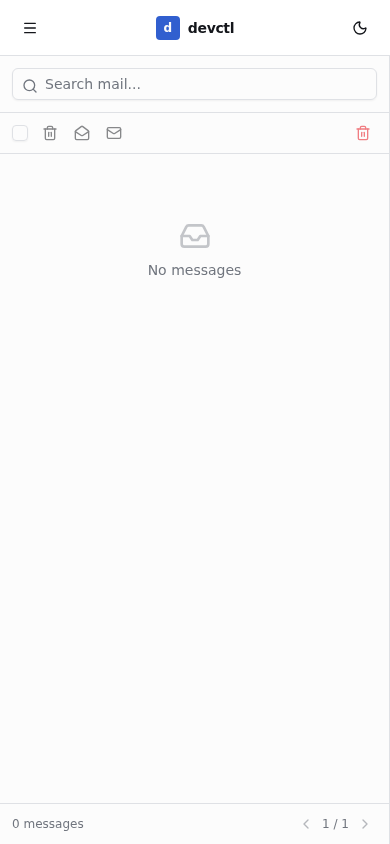

<p align="center">
  
</p>

# devctl

A local PHP development environment dashboard for Linux. Runs as a systemd service and serves a browser UI at `http://127.0.0.1:4000`.

devctl manages Caddy (TLS proxy), a built-in DNS server, PHP-FPM processes, and optional dev services (Valkey/Redis, PostgreSQL, MySQL, Mailpit, Meilisearch, Typesense, Laravel Reverb, RustFS) — all from a single dashboard without touching config files.



---

## Features

- **Services** — start, stop, restart, and one-click install dev services (Valkey, PostgreSQL, MySQL, Mailpit, Meilisearch, Typesense, Laravel Reverb, WhoDB, RustFS) and PHP-FPM versions — all from one tab
- **DNS** — built-in DNS server intercepts configurable TLDs (default `.test`) and returns a configurable target IP; all other queries are forwarded upstream. One-click integration with `systemd-resolved` to route `.test` queries system-wide without any router config
- **Sites** — auto-discovers PHP projects in your sites directory and creates `*.test` vhosts with automatic HTTPS via Caddy's internal CA
- **Git Worktrees** — create and remove git worktrees for any site directly from the UI; each worktree gets its own `*.test` domain, Caddy vhost, and inherits the parent's PHP version
- **PHP CLI** — a global `/usr/local/bin/php` symlink always points at the highest installed PHP version; per-version symlinks (`php8.3`, `php8.4`, …) are also created
- **Global php.ini** — set `memory_limit`, `upload_max_filesize`, `post_max_size`, and `max_execution_time` across all installed PHP versions at once
- **Dumps** — receive and display `php_dd()` / `dd()` variable dumps from any site over TCP (no browser extension needed)
- **Browser notifications** — native desktop notifications when new dumps or mail arrive while you are on another tab; uses the Service Worker Notification API with a direct-API fallback
- **TLS** — download or auto-trust Caddy's root CA certificate so `*.test` sites work without browser warnings
- **SPX Profiler** — per-site PHP profiling via [SPX](https://github.com/NoiseByNorthwest/php-spx); enable per site, then trigger profiles via cookies or query params. View results in the **Profiler** tab with a flat profile table, flamegraph, timeline, and metadata panel
- **Logs** — central log viewer for all managed services. All service logs are written to `~/sites/server/logs/` as `<service>.log` files. Logs rotate automatically at 10 MB (3 backups kept). The **Logs** tab in the dashboard streams live log output via SSE and lets you clear any log file with one click
- **Config editor** — full-screen CodeMirror 6 editor for service config files. Click the file icon next to any config-enabled service (Valkey, MySQL, Meilisearch, Typesense, Mailpit, PHP-FPM) to open its config file in a syntax-highlighted editor with line numbers and Ctrl+F search. PHP has two tabs (`php.ini` / `php-fpm.conf`). Ctrl+S or the **Save & Restart** button writes the file and restarts the service automatically
- **WhoDB** — optional [WhoDB](https://github.com/clidey/whodb) database explorer embedded in the sidebar. Install it from the Services tab; devctl automatically configures pre-populated connection profiles for any installed database (MySQL, PostgreSQL, Valkey/Redis). Manage additional connections and toggle the credential form from the WhoDB section in Settings.

---

## Requirements

- **OS**: Ubuntu 22.04+ or Debian 12+ (amd64)
- **Root access**: devctl runs as a systemd system service (root)
- A non-root user whose `~/sites` directory devctl will manage
- DNS: the `.test` TLD must resolve to your machine. The easiest approach is to use devctl's built-in DNS server with its `systemd-resolved` integration (see [DNS](#dns) below). Alternatively, configure a wildcard `*.test` entry in your router's DNS.

---

## Installation

### From a release binary (recommended)

Download the latest binary from the [Releases](https://github.com/godismyjudge95/devctl/releases) page, then run the interactive installer:

```sh
chmod +x devctl
sudo ./devctl install
```

The installer will prompt for your username and sites directory, write a systemd unit file, enable the service, and confirm it is running. Use `--yes` with `--user` and `--sites-dir` for non-interactive installs:

```sh
sudo ./devctl install --user alice --sites-dir /home/alice/sites --yes
```

The dashboard will be available at **http://127.0.0.1:4000** once the service starts.

### From source

Requirements: Go 1.25+, Node.js 18+, npm.

```sh
git clone https://github.com/godismyjudge95/devctl
cd devctl
make build
sudo make install
sudo systemctl enable --now devctl
```

`make install` copies the binary to `/usr/local/bin/devctl` and writes `devctl.service` to `/etc/systemd/system/` (only on first install — it will not overwrite an existing service file). Edit the service file to set `HOME` and `DEVCTL_SITE_USER` to your actual username before enabling.

---

## Uninstall

```sh
sudo devctl uninstall
```

Stops and disables the service, removes the unit file, and optionally removes the binary and `/etc/devctl/` data directory. Your sites directory is never touched.

To also remove all installed services (Caddy, Valkey, Mailpit, PHP versions, etc.) in one step, use `--purge-services`:

```sh
sudo devctl uninstall --purge-services
```

Or combine with `--yes` to skip all confirmation prompts entirely:

```sh
sudo devctl uninstall --yes --purge-services
```

---

## Screenshots

### Services

Manage dev services and PHP-FPM versions. Caddy is always running. Other services can be installed and started on demand. Expand any row to see connection info (socket path, credentials).

When a newer version of an installed service is available, an amber **"update"** badge appears next to the version string and an **"Update"** button is shown in the actions column. Hovering the button shows a tooltip with the exact from/to versions. Updates run the appropriate migration steps automatically (e.g. Meilisearch dumps and re-imports its data; other services simply replace the binary). devctl checks for updates on startup and again daily at 3 am.


### Sites

Auto-discovered sites from your watch directory. Each site gets a `*.test` vhost with HTTPS. Assign a PHP version per site.



### Git Worktrees

Any git-backed site can have worktrees added to it. Click the fork icon on a site card, pick a branch (or create a new one), configure which paths to symlink or copy from the parent, and click **Create Worktree**. The worktree is created as a sibling directory (`~/sites/myapp-feature-x/`) and immediately gets its own Caddy vhost (`myapp-feature-x.test`).

**Domain naming:** `{parent-dir}-{branch-slug}.test`. Branch slugging: lowercase, `/` and `_` become `-`, and the `origin-` prefix is stripped from remote-tracking refs (so `origin/my-branch` → `myapp-my-branch.test`).

**Shared resources:** devctl detects the project type (Laravel, Statamic, WordPress, or generic) and pre-fills sensible defaults:

| Project type | Symlinked from parent | Copied from parent |
|---|---|---|
| Laravel / Statamic | `vendor`, `node_modules` | `.env` |
| WordPress | — | `.env`, `wp-config.php` |
| Generic | `vendor`, `node_modules` | — |

Check **Save as default for this site** to persist your symlink/copy config in the site's settings for next time.

Worktree cards on the Sites page show a dashed border, a parent-site link, and the branch name. The parent card shows an active-worktree count badge. Remove a worktree via its **Remove worktree** button — this deletes the directory, prunes the git worktree entry, and removes the Caddy vhost.

**Auto-detection:** If a linked worktree directory appears in your watch folder through other means (e.g. `git worktree add` from the terminal), devctl will auto-discover it, recognise the `.git` file pointer, and automatically link it to its parent site in the dashboard.

### Dumps

Receive and display `php_dd()` variable dumps from any PHP site in real time.



### Settings

Configure the dashboard host/port, sites watch directory, TLS certificate trust, and the PHP dump server TCP port.



### Mobile

The dashboard is fully responsive. On narrow viewports the sidebar collapses into a slide-in drawer (hamburger button top-left) and the services list switches to a card layout.

<p align="center">
  
  
  
</p>

---

## Services

| Service | Type | Default port |
|---|---|---|
| Caddy | Supervised (always on) | `:80`, `:443` |
| DNS Server | Embedded goroutine (always on) | `127.0.0.1:5354` (UDP+TCP) |
| Valkey (Redis-compatible) | Supervised | `127.0.0.1:6379` |
| PostgreSQL | systemd | — |
| MySQL | Supervised | `127.0.0.1:3306` |
| Meilisearch | Supervised | `127.0.0.1:7700` (also `meilisearch.test`) |
| Typesense | Supervised | `127.0.0.1:8108` (also `typesense.test`) |
| Mailpit | Supervised | `127.0.0.1:8025` (web), `127.0.0.1:1025` (SMTP) |
| Laravel Reverb | Supervised | `127.0.0.1:7383` (also `reverb.test`) |
| WhoDB | Supervised | `127.0.0.1:8161` (also `whodb.test`) |
| RustFS | Supervised | `127.0.0.1:9000` (S3 API), `127.0.0.1:9001` (console, also `rustfs.test`) |
| PHP-FPM (per version) | Supervised | Unix socket `/run/php/phpX.Y-fpm.sock` |

Supervised services run as direct child processes of devctl. Valkey's service ID is `redis` for Laravel `.env` compatibility.

Each service that supports a config file is started with a native config file (e.g. `valkey.conf`, `config.toml`, `typesense.ini`). These files are written once on install and are user-editable — devctl never overwrites them on restart. Mailpit is configured via `MP_*` environment variables in `config.env`. Click the file (FileText) icon on any config-enabled service row in the dashboard to open the file in the full-screen config editor.

---

## DNS

devctl includes a built-in DNS server that runs as an in-process goroutine (no separate binary). It intercepts queries for configurable TLDs and returns a fixed A record, forwarding everything else to the system upstream resolver.

**Default behaviour:**
- Listens on `127.0.0.1:5354` (UDP and TCP)
- Intercepts `*.test` queries and returns your primary LAN IP
- Forwards all other queries to the upstream nameserver (read from `/run/systemd/resolve/resolv.conf`, falling back to `/etc/resolv.conf`, then `8.8.8.8`)

**Configuring via the dashboard:**

Open the gear icon on the DNS Server row in the Services tab to configure:

| Setting | Description |
|---|---|
| Port | UDP/TCP port the server listens on (default `5354`) |
| TLD(s) | Comma-separated list of TLDs to intercept (default `.test`) |
| Target IP | IP address returned for intercepted queries. Click **Auto-detect** to use your primary LAN IP. |
| System DNS | Writes a `systemd-resolved` drop-in so `.test` queries are routed to devctl system-wide |

**System DNS integration:**

Click **Configure** in the DNS settings dialog to write `/etc/systemd/resolved.conf.d/99-devctl-dns.conf` and restart `systemd-resolved`. This routes all `.test` queries on the machine to devctl's DNS server — no router configuration or `/etc/hosts` entries needed.

The generated drop-in looks like:

```ini
[Resolve]
DNS=127.0.0.1:5354
Domains=~test
```

Click **Remove** to delete the drop-in and restore the previous resolver behaviour.

---

## PHP

PHP versions are installed from the [static-php-cli](https://github.com/crazywhalecc/static-php-cli) project as self-contained static binaries — no PPA or system packages required. Any version available on that index can be installed from the Services tab.

Each version runs as:
```
{siteHome}/sites/server/php/{version}/php-fpm --nodaemonize --fpm-config {siteHome}/sites/server/php/{version}/php-fpm.conf
```

**PHP configuration:**

On first install, devctl creates a `php.ini` based on the full upstream `php.ini-development` template with the following devctl-specific overrides appended:

- `upload_max_filesize = 128M`, `memory_limit = 256M`, `post_max_size = 128M`, `max_execution_time = 120`
- OPcache enabled with `validate_timestamps=1` and `revalidate_freq=0` (dev-safe: file changes are always picked up)
- SPX profiler settings and `auto_prepend_file` for `php_dd()` support

The `php.ini` is user-editable and never overwritten on restart. The **Global PHP Settings** UI patches the resource-limit keys directly in the file. Click the file icon on the PHP-FPM row in the Services tab to open `php.ini` or `php-fpm.conf` in the full-screen config editor. To regenerate the file with updated defaults, delete it and restart devctl.

**CLI symlinks created on install:**
- `/usr/local/bin/php{version}` — points at the version-specific CLI binary (e.g. `php8.4`)
- `/usr/local/bin/php` — always points at the highest installed version

---

## Browser Notifications

devctl can fire native desktop notifications when new dumps or mail arrive while you are viewing a different tab.

- **Dumps** — a notification fires whenever a new `php_dd()` dump arrives and you are not currently on the `/dumps` page. A single dump shows a short plain-text value preview; multiple dumps arriving within 1.5 seconds are collapsed into one notification showing the total count. Clicking the notification navigates directly to that dump.
- **Mail** — a notification fires whenever a new message arrives in Mailpit and you are not on the `/mail` page. A single message shows the sender and subject; bursts are collapsed. Clicking navigates to the Mail page.
- **Service updates** — a notification fires when the update checker (runs on startup and daily at 3 am) finds a newer version for any installed service.

Notifications are requested automatically on first load. devctl uses the **Service Worker Notification API** when supported (enabling reliable window-focusing on all platforms), with a direct `Notification` API fallback for browsers without service worker support.

---

## SPX Profiler

devctl includes native support for [SPX](https://github.com/NoiseByNorthwest/php-spx), a low-overhead PHP profiler. SPX is compiled directly into devctl's custom PHP binaries (available for PHP 8.1–8.4, x86_64) and has zero overhead when not actively profiling.

**Enabling SPX for a site:**

1. Open a site's settings dialog (gear icon on the site card).
2. Toggle **SPX Profiling** on and save. devctl rewrites the PHP-FPM ini and restarts the pool.

Once enabled, the **Profiler** navigation item appears in the sidebar.

**Triggering a profile:**

Activate profiling for a request by sending the `SPX_ENABLED=1` and `SPX_KEY=dev` cookies, or as query parameters:

```
https://mysite.test/some/page?SPX_ENABLED=1&SPX_KEY=dev
```

The profile is automatically saved to disk and appears in the Profiler tab.

**Profiler views:**

| Tab | Description |
|---|---|
| Flat Profile | Sorted table of all called functions with exclusive/inclusive time and call count |
| Flamegraph | SVG call stack visualization — hover for details, colour by call depth |
| Timeline | Chronological call timeline with function name labels |
| Metadata | Request URL, duration, peak memory, and other profiler metadata |

**Data storage:** profiles are stored at `{serverRoot}/php/{version}/spx-data/` and can be cleared from the UI.

---

## PHP Dumps (`php_dd`)

devctl injects `auto_prepend_file = /etc/devctl/prepend.php` into every installed PHP version's FPM ini. This makes a `php_dd()` helper available in all your sites — calling it sends a serialized variable dump to devctl's TCP listener (default port `9912`), which displays it in the **Dumps** tab.

```php
php_dd($someVariable);  // appears in the Dumps tab
```

No browser extension or Xdebug configuration required.

---

## Ports

| Port | Service | Configurable |
|---|---|---|
| `127.0.0.1:4000` | devctl dashboard | Yes (Settings → Dashboard) |
| `:80` / `:443` | Caddy | No |
| `127.0.0.1:2019` | Caddy Admin API | Yes (Settings) |
| `127.0.0.1:5354` | DNS server (UDP+TCP) | Yes (Services → DNS → Settings) |
| `127.0.0.1:9912` | PHP dump receiver | Yes (Settings → PHP Dump Server) |
| `127.0.0.1:6379` | Valkey | No |
| `127.0.0.1:3306` | MySQL | No |
| `127.0.0.1:7700` | Meilisearch | No |
| `127.0.0.1:8108` | Typesense | No |
| `127.0.0.1:8025` | Mailpit (web) | Yes |
| `127.0.0.1:1025` | Mailpit (SMTP) | Yes |
| `127.0.0.1:7383` | Laravel Reverb | No |
| `127.0.0.1:8161` | WhoDB | No |
| `127.0.0.1:9000` | RustFS (S3 API) | No |
| `127.0.0.1:9001` | RustFS (console) | No |

---

## Data paths

| Path | Contents |
|---|---|
| `/etc/devctl/devctl.db` | SQLite database (sites, settings, dumps) |
| `/etc/devctl/prepend.php` | PHP auto-prepend for `php_dd()` |
| `/etc/systemd/system/devctl.service` | Systemd unit file |
| `~/sites/server/` | Service binaries and data (Caddy, Valkey, MySQL, etc.) |
| `~/sites/server/logs/` | Service log files (`caddy.log`, `dns.log`, `mysql.log`, etc.) |

---

## MCP Server

devctl includes a built-in [Model Context Protocol (MCP)](https://modelcontextprotocol.io) server, allowing AI assistants (Claude, OpenCode, Cursor, etc.) to interact with your local dev environment directly — checking service health, reading logs, switching PHP versions, managing DNS, and more.

The MCP server is embedded in the devctl binary and served at:

```
http://127.0.0.1:4000/mcp
```

It uses the **StreamableHTTP** transport, which is supported by all modern MCP clients.

### Connecting an AI assistant

**OpenCode** (`~/.config/opencode/opencode.json`):

```json
{
  "mcp": {
    "devctl": {
      "type": "remote",
      "url": "http://127.0.0.1:4000/mcp"
    }
  }
}
```

**Claude Desktop** (`claude_desktop_config.json`):

```json
{
  "mcpServers": {
    "devctl": {
      "command": "npx",
      "args": ["-y", "mcp-remote", "http://127.0.0.1:4000/mcp"]
    }
  }
}
```

**Cursor / other clients** — add `http://127.0.0.1:4000/mcp` as an MCP server URL in your client's settings.

### Available tools

| Tool | Description |
|---|---|
| `listSites` | List all sites with domain, PHP version, framework, HTTPS and SPX state |
| `getSiteDetail` | Full details for a single site by domain |
| `switchPHPVersion` | Switch the PHP version for a site |
| `toggleSPXProfiler` | Enable or disable the SPX profiler for a site |
| `listServices` | List all managed services and their current status |
| `startService` | Start a stopped service |
| `stopService` | Stop a running service (required services are protected) |
| `restartService` | Restart a service |
| `getServiceCredentials` | Get connection credentials for a service (host, port, user, password) |
| `listPHPVersions` | List installed PHP versions, FPM socket paths, and status |
| `getPHPSettings` | Read current PHP ini settings (memory_limit, upload limits, etc.) |
| `setPHPSettings` | Update PHP ini settings across all installed versions |
| `getSettings` | Read devctl settings (ports, DNS config, TLD) |
| `setSettings` | Update devctl settings |
| `getSPXProfiles` | List recent SPX profiler captures, optionally filtered by domain |
| `getSPXProfileDetail` | Get top CPU hotspot functions for a specific profile |
| `getDumps` | List recent `php_dd()` variable dumps |
| `clearDumps` | Delete all captured dumps |
| `listLogs` | List available log files |
| `getLogTail` | Read the tail of a log file |
| `clearLog` | Truncate a log file |
| `checkDNSSetup` | Check whether `systemd-resolved` is configured for `*.test` routing |
| `configureDNS` | Write the `systemd-resolved` drop-in for `*.test` routing |
| `teardownDNS` | Remove the `systemd-resolved` drop-in |
| `trustCA` | Trust Caddy's internal CA in the system and browser certificate stores |

### Available prompts

| Prompt | Description |
|---|---|
| `DiagnoseSiteIssue` | Walk the AI through diagnosing a broken or misbehaving site |
| `EnableProfiling` | Guide the AI through enabling SPX and capturing a profile |
| `ServiceHealthCheck` | Check all services, identify unhealthy ones, and offer to fix them |

### Available resources

| Resource | Description |
|---|---|
| `devctl://services` | Live snapshot of all service statuses |
| `devctl://sites` | All configured sites |
| `devctl://php-versions` | Installed PHP versions |
| `devctl://settings` | Current devctl settings |

---

## Build commands

```sh
make dev          # go run . (backend only, no frontend rebuild)
make dev-ui       # Vite HMR dev server (frontend only)
make build        # build frontend + go build
make install      # build + install binary + systemd unit (requires root)
make sqlc         # regenerate db/queries/*.go from SQL
make db-migrate   # apply goose migrations to /etc/devctl/devctl.db
```

---

## Tech stack

| Layer | Choice |
|---|---|
| Backend | Go 1.25, stdlib `net/http` |
| Database | SQLite (`modernc.org/sqlite`), sqlc, goose |
| Frontend | Vue 3, TypeScript, Pinia, Vite 7, Tailwind CSS v4, shadcn-vue |
| Proxy / TLS | Caddy with internal CA, wildcard `*.test` certs |

---

## License

MIT
