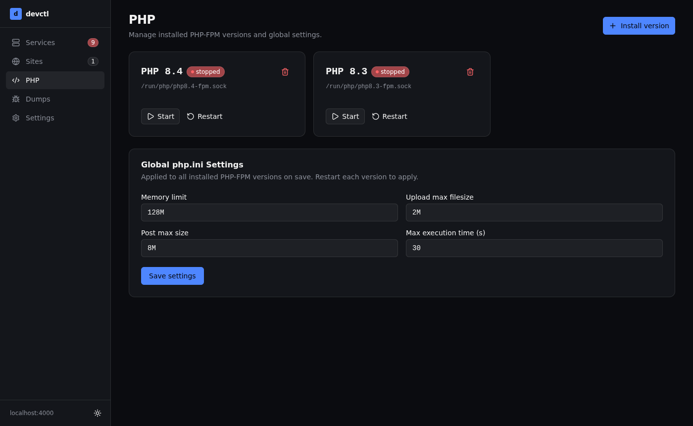

# devctl

A local PHP development environment dashboard for Linux. Runs as a systemd service and serves a browser UI at `http://127.0.0.1:4000`.

devctl manages Caddy (TLS proxy), PHP-FPM processes, and optional dev services (Valkey/Redis, PostgreSQL, MySQL, Mailpit, Meilisearch, Typesense, Laravel Reverb) — all from a single dashboard without touching config files.


---

## Features

- **Services** — start, stop, restart, and one-click install dev services (Valkey, PostgreSQL, MySQL, Mailpit, Meilisearch, Typesense, Laravel Reverb)
- **Sites** — auto-discovers PHP projects in your sites directory and creates `*.test` vhosts with automatic HTTPS via Caddy's internal CA
- **PHP** — install and manage multiple PHP-FPM versions side by side; start/stop/restart each version independently
- **Global php.ini** — set `memory_limit`, `upload_max_filesize`, `post_max_size`, and `max_execution_time` across all installed PHP versions at once
- **Dumps** — receive and display `php_dd()` / `dd()` variable dumps from any site over TCP (no browser extension needed)
- **TLS** — download or auto-trust Caddy's root CA certificate so `*.test` sites work without browser warnings

---

## Requirements

- **OS**: Ubuntu 22.04+ or Debian 12+ (amd64)
- **Root access**: devctl runs as a systemd system service (root)
- A non-root user whose `~/sites` directory devctl will manage
- DNS: the `.test` TLD must resolve to your machine. The recommended approach is a router-level wildcard DNS entry pointing `*.test` at your local IP. No `/etc/hosts` entries are needed.

---

## Installation

### From a release binary (recommended)

Download the latest binary from the [Releases](https://github.com/godismyjudge95/devctl/releases) page, then run the interactive installer:

```sh
chmod +x devctl
sudo ./devctl install
```

The installer will prompt for your username and sites directory, write a systemd unit file, enable the service, and confirm it is running. Use `--yes` with `--user` and `--sites-dir` for non-interactive installs:

```sh
sudo ./devctl install --user alice --sites-dir /home/alice/sites --yes
```

The dashboard will be available at **http://127.0.0.1:4000** once the service starts.

### From source

Requirements: Go 1.25+, Node.js 18+, npm.

```sh
git clone https://github.com/godismyjudge95/devctl
cd devctl
make build
sudo make install
sudo systemctl enable --now devctl
```

`make install` copies the binary to `/usr/local/bin/devctl` and writes `devctl.service` to `/etc/systemd/system/` (only on first install — it will not overwrite an existing service file). Edit the service file to set `HOME` and `DEVCTL_SITE_USER` to your actual username before enabling.

---

## Uninstall

```sh
sudo devctl uninstall
```

Stops and disables the service, removes the unit file, and optionally removes the binary and `/etc/devctl/` data directory. Your sites directory is never touched.

---

## Screenshots

### Services

Manage dev services. Caddy is always running. Other services can be installed and started on demand. PHP-FPM versions installed via the PHP tab also appear here.


### Sites

Auto-discovered sites from your watch directory. Each site gets a `*.test` vhost with HTTPS. Assign a PHP version per site.


### PHP

Install PHP-FPM versions and control each one independently. Configure global php.ini settings applied across all versions.



### Settings

Configure the dashboard host/port, sites watch directory, TLS certificate trust, and the PHP dump server TCP port.


---

## Services

| Service | Type | Default port |
|---|---|---|
| Caddy | Supervised (always on) | `:80`, `:443` |
| Valkey (Redis-compatible) | Supervised | `127.0.0.1:6379` |
| PostgreSQL | systemd | — |
| MySQL | systemd | — |
| Meilisearch | Supervised | `127.0.0.1:7700` (also `meilisearch.test`) |
| Typesense | Supervised | `127.0.0.1:8108` (also `typesense.test`) |
| Mailpit | Supervised | `127.0.0.1:8025` (web), `127.0.0.1:1025` (SMTP) |
| Laravel Reverb | Supervised | `127.0.0.1:7383` (also `reverb.test`) |
| PHP-FPM (per version) | Supervised | Unix socket `/run/php/phpX.Y-fpm.sock` |

Supervised services run as direct child processes of devctl. Valkey's service ID is `redis` for Laravel `.env` compatibility.

---

## PHP

PHP versions are installed from the [ondrej/php](https://launchpad.net/~ondrej/+archive/ubuntu/php) PPA. Any version available in that PPA can be installed from the UI.

**Default extensions installed with every version:**
`bcmath`, `curl`, `gd`, `imagick`, `intl`, `mbstring`, `mysql`, `pgsql`, `redis`, `sqlite3`, `xml`, `xmlwriter`, `zip`, `opcache`, `readline`, `soap`

Each version runs as:
```
/usr/sbin/php-fpmX.Y --nodaemonize --fpm-config /etc/php/X.Y/fpm/php-fpm.conf
```

---

## PHP Dumps (`php_dd`)

devctl injects `auto_prepend_file = /etc/devctl/prepend.php` into every installed PHP version's FPM ini. This makes a `php_dd()` helper available in all your sites — calling it sends a serialized variable dump to devctl's TCP listener (default port `9912`), which displays it in the **Dumps** tab.

```php
php_dd($someVariable);  // appears in the Dumps tab
```

No browser extension or Xdebug configuration required.

---

## Ports

| Port | Service | Configurable |
|---|---|---|
| `127.0.0.1:4000` | devctl dashboard | Yes (Settings → Dashboard) |
| `:80` / `:443` | Caddy | No |
| `127.0.0.1:2019` | Caddy Admin API | Yes (Settings) |
| `127.0.0.1:9912` | PHP dump receiver | Yes (Settings → PHP Dump Server) |
| `127.0.0.1:6379` | Valkey | No |
| `127.0.0.1:7700` | Meilisearch | No |
| `127.0.0.1:8108` | Typesense | No |
| `127.0.0.1:8025` | Mailpit (web) | Yes |
| `127.0.0.1:1025` | Mailpit (SMTP) | Yes |
| `127.0.0.1:7383` | Laravel Reverb | No |

---

## Data paths

| Path | Contents |
|---|---|
| `/etc/devctl/devctl.db` | SQLite database (sites, settings, dumps) |
| `/etc/devctl/prepend.php` | PHP auto-prepend for `php_dd()` |
| `/etc/systemd/system/devctl.service` | Systemd unit file |
| `~/sites/server/` | Service binaries and data (Caddy, Valkey, etc.) |

---

## Build commands

```sh
make dev          # go run . (backend only, no frontend rebuild)
make dev-ui       # Vite HMR dev server (frontend only)
make build        # build frontend + go build
make install      # build + install binary + systemd unit (requires root)
make sqlc         # regenerate db/queries/*.go from SQL
make db-migrate   # apply goose migrations to /etc/devctl/devctl.db
```

---

## Tech stack

| Layer | Choice |
|---|---|
| Backend | Go 1.25, stdlib `net/http` |
| Database | SQLite (`modernc.org/sqlite`), sqlc, goose |
| Frontend | Vue 3, TypeScript, Pinia, Vite 7, Tailwind CSS v4, shadcn-vue |
| Proxy / TLS | Caddy with internal CA, wildcard `*.test` certs |

---

## License

MIT
