<p align="center">
  
</p>

# devctl

A local PHP development environment dashboard for Linux. Runs as a **non-root** systemd service (with ambient capabilities for ports 80/443) and serves a browser UI at `http://127.0.0.1:4000`.

devctl manages Caddy (TLS proxy), a built-in DNS server, PHP-FPM processes, and optional dev services (Valkey/Redis, PostgreSQL, MySQL, Mailpit, Meilisearch, Typesense, Laravel Reverb, MaxIO, ClickHouse) — all from a single dashboard without touching config files.

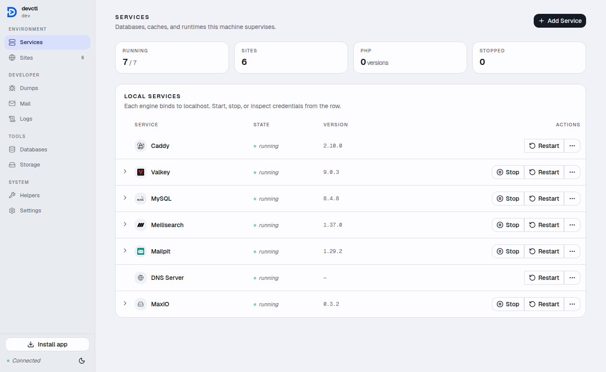

---

## Table of Contents

- [Overview](#overview)
- [Comparison](#comparison)
- [Requirements](#requirements)
- [Installation](#installation)
  - [From a release binary](#from-a-release-binary)
  - [From source](#from-source)
- [Uninstall](#uninstall)
- [Services](#services)
- [Helpers](#helpers)
- [PHP](#php)
- [DNS](#dns)
- [Sites](#sites)
- [Git Worktrees](#git-worktrees)
- [PHP Dumps (php\_dd)](#php-dumps-php_dd)
- [SPX Profiler](#spx-profiler)
- [Mail](#mail)
- [Config Editor](#config-editor)
- [Logs](#logs)
- [Browser Notifications](#browser-notifications)
- [PWA (Install as an App)](#pwa-install-as-an-app)
- [CLI](#cli)
- [Ports](#ports)
- [Data Paths](#data-paths)
- [Contributing & Development](#contributing--development)
- [License](#license)

---

## Overview

devctl is a self-contained development environment manager for PHP projects on Linux. Everything runs from a single statically-linked binary that you install once and forget about:

- **No Docker**, no VMs, no `sudo` on every command.
- **One dashboard** at `http://127.0.0.1:4000` to start/stop/install services, manage PHP versions, view logs, and inspect variable dumps.
- **Automatic HTTPS** for all `*.test` sites via Caddy's internal CA — no browser warnings once you trust the certificate once.
- **Zero config files to edit** — devctl writes sensible defaults on first install. Every config file is user-editable and never overwritten on restart.
- **AI-friendly** — a CLI lets AI agents (OpenCode, Claude, Cursor) interact with your dev environment without root: `devctl services:list`, `devctl sites:list`, `devctl logs:tail caddy`, etc.

All service binaries are downloaded directly from their upstream releases and stored under your sites directory (default `~/sites/server/`). Nothing is installed system-wide except the devctl binary and systemd unit.

---

## Comparison

How devctl compares to [Laravel Herd](https://herd.laravel.com), [Lerd](https://github.com/lerd-env/lerd), and [Yerd](https://github.com/forjedio/yerd). Competitor columns summarize their public docs and README comparison tables; features change over time — verify upstream if you need the latest.

| | Laravel Herd | Lerd | Yerd | **devctl** |
|---|---|---|---|---|
| Free | ✅ (Pro is paid) | ✅ | ✅ | ✅ |
| Open source | ❌ | ✅ | ✅ | ✅ |
| Linux | ❌ | ✅ | ✅ | ✅ |
| macOS | ✅ | ✅ | ✅ | ❌ |
| Windows | ✅ | WSL2 (beta) | ❌ | WSL2 |
| Automatic `.test` domains | ✅ | ✅ | ✅ | ✅ |
| HTTPS with a trusted local CA | ✅ | ✅ | ✅ | ✅ |
| Multiple PHP versions | ✅ | ✅ | ✅ | ✅ |
| PHP version **per site** | ✅ | ✅ | ✅ | ✅ |
| PHP runtime | PHP-FPM | PHP-FPM · FrankenPHP | PHP-FPM | PHP-FPM |
| First-class CLI | ✅ | ✅ | ✅ | ✅ |
| UI | Native app | Web app | Desktop app | Web app |
| Menu-bar / tray | ✅ | ✅ | ✅ | ❌ |
| MySQL | ✅ (Pro) | ✅ | ✅ | ✅ |
| MariaDB | ✅ (Pro) | ✅ | ✅ | ❌ |
| PostgreSQL | ✅ (Pro) | ✅ | ✅ | ✅ |
| Redis | ✅ (Pro) | ✅ | ✅ | ✅ (Valkey) |
| ClickHouse | ❌ | ❌ | ❌ | ✅ |
| Meilisearch | ❌ | ✅ | ❌ | ✅ |
| Typesense | ❌ | ❌ | ❌ | ✅ |
| Object storage (S3) | ❌ | ✅ (RustFS) | ❌ | ✅ (MaxIO) |
| Mail capture | ✅ (Pro) | ✅ | ✅ | ✅ (Mailpit) |
| WebSockets (Reverb) | ✅ (Pro) | ✅ | ❌ | ✅ |
| Database GUI | ❌ | ✅ | ❌ | ✅ (built-in) |
| Variable dump inspector | ✅ (Pro) | ✅ | ✅ | ✅ (`php_dd`) |
| Full query / N+1 inspector | ✅ (Pro) | ✅ | ✅ | ❌ |
| SPX profiler | ❌ | ✅ | ❌ | ✅ |
| Git worktrees | ❌ | ✅ | ❌ | ✅ |
| Share a site publicly | ✅ | ✅ | ✅ | ❌ |
| Health checks (`doctor`) | ❌ | ✅ | ✅ | ❌ |
| AI integration | MCP | MCP | ❌ | CLI + skill |
| Per-project Node isolation | ❌ | ✅ | tools install | ❌ |
| Rootless day-to-day | ✅ | ✅ | ✅ | ✅ |
| Containers / VM | None | Podman | None | None [^no-containers] |

[^no-containers]: No Docker/Podman by design — managed services are native binaries, not container images.

**Related comparisons (upstream):** [Yerd vs Herd vs Lerd](https://github.com/forjedio/yerd#yerd-vs-herd-vs-lerd) · [Why Lerd](https://github.com/lerd-env/lerd#why-lerd)

---

## Requirements

- **OS**: Ubuntu 22.04+ or Debian 12+ (amd64)
- **sudo once** for install and elevation (CA trust, DNS resolver, privileged ports) — day-to-day work does **not** need root
- A non-root user whose `~/sites` directory devctl will manage
- **DNS**: the `.test` TLD must resolve to your machine. The easiest approach is `sudo devctl elevate resolver` (see [Elevation](#elevation) and [DNS](#dns)). Alternatively, configure a wildcard `*.test` entry in your router's DNS.

---

## Installation

### From a release binary

Download the latest binary from the [Releases](https://github.com/godismyjudge95/devctl/releases) page, then run the interactive installer:

```sh
chmod +x devctl
sudo ./devctl install
```

The installer prompts you to confirm:

1. Which user's sites directory devctl should manage (auto-detected from `SUDO_USER`)
2. Where your sites are stored (default: `~/sites`)
3. Where to install the devctl binary (default: `~/sites/server/devctl/devctl`)

It then writes the systemd unit file, enables the service, and confirms it is running.

For non-interactive (scripted) installs, pass all flags explicitly:

```sh
sudo ./devctl install --user alice --sites-dir /home/alice/sites --yes
```

| Flag | Description |
|---|---|
| `--user` | Non-root user whose sites dir devctl will manage. Auto-detected from `SUDO_USER` if omitted. |
| `--sites-dir` | Directory where sites are stored. Default: `~/sites`. |
| `--path` | Directory to install the devctl binary into. Default: `{sites-dir}/server/devctl`. |
| `--yes` | Skip all confirmation prompts. Requires `--user` in non-interactive mode. |

The dashboard will be available at **http://127.0.0.1:4000** once the service starts.

### From source

Requirements: Go 1.25+, Node.js 18+, npm.

```sh
git clone https://github.com/godismyjudge95/devctl
cd devctl
make build
sudo make install
sudo systemctl enable --now devctl
```

`make install` copies the binary to `~/sites/server/devctl/devctl` and writes `devctl.service` to `/etc/systemd/system/`. Edit the service file to set `HOME`, `DEVCTL_SITE_USER`, and `DEVCTL_SERVER_ROOT` to your actual values before enabling.

---

## Auto-update

devctl checks GitHub for a newer release once per day at 3 am.

When a newer version is available an amber **↑** button appears next to the **devctl** logo in the sidebar. Hovering over it shows a tooltip with the target version (e.g. *Update devctl to v0.4.0*). Clicking the button opens a progress dialog that streams the download and install steps live, then automatically restarts the service.

**How it works:**

1. The current binary is downloaded from the GitHub release page and verified by running `--version`.
2. The running binary is backed up as `devctl.bak` next to the installed binary.
3. The new binary replaces the current one atomically.
4. `systemctl restart devctl` is triggered — the service comes back up on the new version within seconds.
5. On the next clean startup, the `devctl.bak` backup is removed automatically.

If the download or verification step fails the current binary is not replaced and an error is shown in the dialog.

---

## Uninstall

```sh
sudo devctl uninstall
```

Stops and disables the service, removes the systemd unit file, and optionally removes the binary and devctl data directory (`{serverRoot}/devctl/`). Your sites directory is never touched.

To also remove all installed service binaries in one step, use `--purge-services`:

```sh
sudo devctl uninstall --purge-services
```

Or combine with `--yes` to skip all confirmation prompts:

```sh
sudo devctl uninstall --yes --purge-services
```

---

## Services

Manage all services from the **Services** tab of the dashboard. Caddy and the DNS server are always-on. All other services are optional and can be installed on demand with one click.

Each installed service can be started, stopped, and restarted from the dashboard. Expand any service row to view connection credentials and the config file path.

### Update checker

devctl checks for newer versions once per day at 3 am. When an update is available, an amber **"update"** badge appears next to the version string and an **Update** button is shown. Hovering shows the exact from/to version. Updates stream their output live via SSE.

| Service | Port(s) | `.test` vhost | Download source | Config file |
|---|---|---|---|---|
| Caddy | `:80`, `:443`, `127.0.0.1:2019` (admin) | — | [github.com/caddyserver/caddy](https://github.com/caddyserver/caddy/releases) | `{serverRoot}/caddy/Caddyfile` (auto-managed) |
| DNS Server | `127.0.0.1:5354` (UDP+TCP) | — | Embedded goroutine (no download) | — |
| Valkey (Redis-compatible) | `127.0.0.1:6379` | — | [download.valkey.io](https://download.valkey.io/releases/) | `{serverRoot}/valkey/valkey.conf` |
| PostgreSQL + extensions | `127.0.0.1:5432` | — | [Percona PG tarball](https://downloads.percona.com/downloads/postgresql-distribution-18/) + [TimescaleDB Community `.deb`](https://packagecloud.io/timescale/timescaledb) + [pgvector](https://github.com/pgvector/pgvector) (portable rebuild) + [pg_clickhouse `.deb`](https://github.com/ClickHouse/pg_clickhouse/releases) (extracted in-place) | `{serverRoot}/postgres/data/postgresql.conf` |
| MySQL | `127.0.0.1:3306` | — | [repo.mysql.com/apt](https://repo.mysql.com/apt/) (Ubuntu `.deb` packages, extracted in-place) | `{serverRoot}/mysql/my.cnf` |
| Meilisearch | `127.0.0.1:7700` | `meilisearch.test` | [github.com/meilisearch/meilisearch](https://github.com/meilisearch/meilisearch/releases) | `{serverRoot}/meilisearch/config.toml` |
| Typesense | `127.0.0.1:8108` | `typesense.test` | [dl.typesense.org](https://dl.typesense.org/releases/) | `{serverRoot}/typesense/typesense.ini` |
| Mailpit | `127.0.0.1:8025` (web), `127.0.0.1:1025` (SMTP) | — | [github.com/axllent/mailpit](https://github.com/axllent/mailpit/releases) | `{serverRoot}/mailpit/config.env` (env vars) |
| Laravel Reverb | `127.0.0.1:7383` | `reverb.test` | [packagist.org/laravel/reverb](https://packagist.org/packages/laravel/reverb) (via Composer) | `{serverRoot}/reverb/.env` |
| MaxIO | `127.0.0.1:9900` (S3 API) | `maxio.test`, `s3.maxio.test` | [github.com/coollabsio/maxio](https://github.com/coollabsio/maxio/releases) (always latest) | `{serverRoot}/maxio/config.env` |
| ClickHouse | `127.0.0.1:8123` (HTTP), `127.0.0.1:9000` (native TCP) | — | [packages.clickhouse.com/tgz](https://packages.clickhouse.com/tgz/stable/) (binary only) | `{serverRoot}/clickhouse/config.xml` |
| PHP-FPM (per version) | Unix socket | — | [static-php-cli](https://github.com/crazywhalecc/static-php-cli) | `{serverRoot}/php/{version}/php.ini` |

**Notes:**

- Supervised services (Valkey, MySQL, Meilisearch, Typesense, Mailpit, Reverb, MaxIO, ClickHouse, PHP-FPM) run as direct child processes of devctl with automatic restart on crash.
- PostgreSQL and ClickHouse run as supervised child processes but drop privileges to `DEVCTL_SITE_USER` (both refuse to start as root against non-root data).
- PostgreSQL manages extensions via a small registry: [TimescaleDB Community Edition](https://github.com/timescale/timescaledb), [pgvector](https://github.com/pgvector/pgvector) (rebuilt from source with `OPTFLAGS=""` so Percona's `-march=native` AVX-512 binary is replaced with a portable build), and [pg_clickhouse](https://github.com/ClickHouse/pg_clickhouse) (Timescale + pg_clickhouse extracted from `.deb` files into the Percona tree — no APT). Timescale sets `shared_preload_libraries` and runs `CREATE EXTENSION` on the default `postgres` database. When ClickHouse is also installed (either install order), `pg_clickhouse` is wired into **`template1`** only (`CREATE EXTENSION` + foreign server `clickhouse` + user mapping for the superuser), so new databases inherit the FDW. Status: Services → PostgreSQL → Settings, or `devctl postgres:extensions`.
- Valkey's service ID is `redis` for Laravel `.env` compatibility (`REDIS_HOST`, `REDIS_PORT`, etc.).
- Config files are written once on install and never overwritten on restart. User edits are preserved.
- Mailpit is configured via `MP_*` environment variables in `config.env` rather than a native config file.
- Meilisearch updates are handled autonomously: devctl dumps the index data, replaces the binary, then re-imports the dump automatically.
- Reverb exposes a Laravel-ready credentials block in the Services view: `REVERB_APP_ID=1001`, `REVERB_APP_KEY=DEVCTL`, `REVERB_APP_SECRET=DEVCTL`, `REVERB_HOST=reverb.test`, `REVERB_PORT=443`, `REVERB_SCHEME=https`.
- ClickHouse is installed as a single multi-call binary (no APT/Docker). CLI tools (`clickhouse-client`, `clickhouse-local`, …) are symlinked into `{serverRoot}/bin`. It uses the upstream default ports (`8123` HTTP, `9000` native TCP). The process runs as `DEVCTL_SITE_USER` because ClickHouse refuses to start as root against a non-root data directory.

### Databases

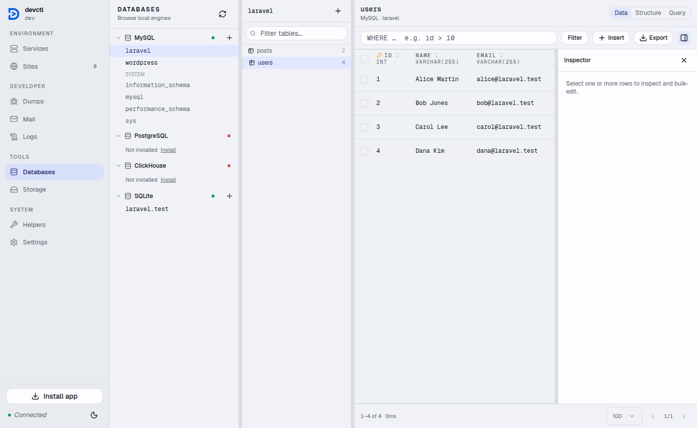

The **Databases** sidebar opens a built-in explorer (not an iframe) for every local engine that is installed and running:

- **MySQL** and **PostgreSQL** — full catalog/table browser, inline cell edit, insert/delete rows, create/drop databases and tables
- **ClickHouse** — browse databases/tables and run SQL (row-level edits are not supported)
- **SQLite** — auto-discovers Laravel-style `{site}/database/database.sqlite` files under the sites directory

The layout follows TablePlus: engines and databases on the left, tables in the middle, and a Data / Structure / Query pane on the right. Shift-click selects a range and Ctrl/⌘-click toggles individual databases, tables, or rows. Double-click a cell to edit (when the table has a primary key). The query editor runs SQL against the selected database; Ctrl/⌘+Enter executes.

### MaxIO

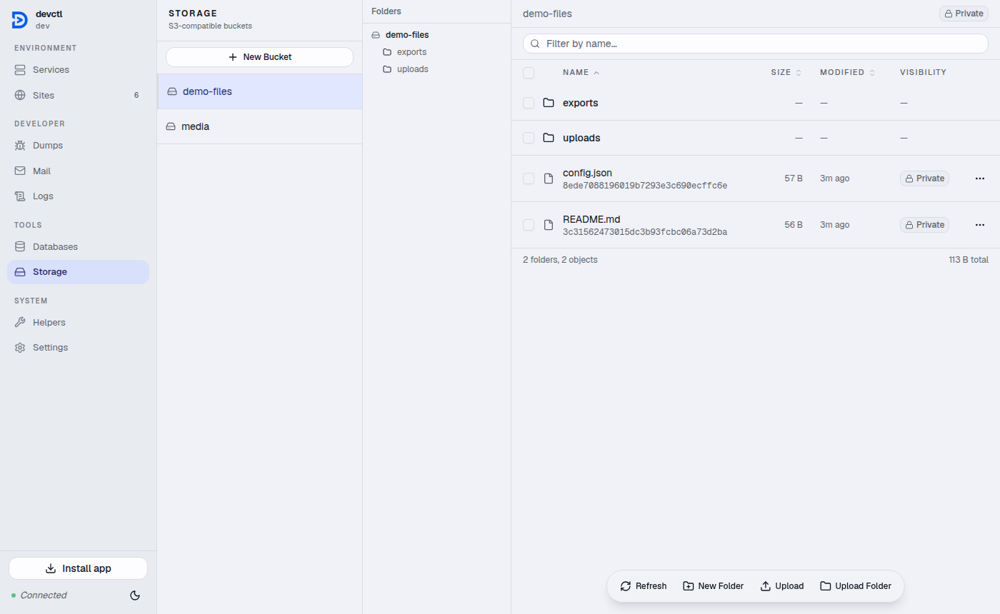

[MaxIO](https://github.com/coollabsio/maxio) is a high-performance S3-compatible object storage server (single binary from coollabsio/maxio). Install it from the Services tab. Default credentials are `devctl` / `devctlsecret` — edit `{serverRoot}/maxio/config.env` to change them. Data is stored at `{serverRoot}/maxio/data`. The S3 API listens on loopback port `9900` and is reached via the `s3.maxio.test` / `maxio.test` Caddy vhosts (and the dashboard Storage UI). Browser uploads (e.g. Livewire direct-to-S3) work cross-origin because Caddy injects CORS headers on `s3.maxio.test` (and every new bucket also gets a permissive S3 CORS policy).

For Laravel, copy the generated `connection.env` values into your `.env`:

```env
AWS_ENDPOINT=https://s3.maxio.test
```

---

## Helpers

Helpers are optional CLI binaries downloaded into `{serverRoot}/bin/` (on `PATH`). They are not supervised services — no start/stop, just install / update / uninstall.

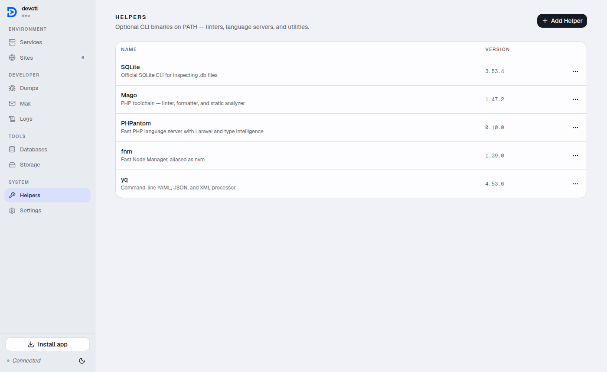

sqlite3 is installed by default. Everything else is opt-in from the **Helpers** page or the CLI.

| Helper | Source | Notes |
|---|---|---|
| `sqlite3` | [sqlite.org](https://www.sqlite.org/download.html) | Default. Cannot be uninstalled. |
| `mago` | [carthage-software/mago](https://github.com/carthage-software/mago) | PHP linter / formatter / analyzer |
| `phpantom_lsp` | [PHPantom-dev/phpantom_lsp](https://github.com/PHPantom-dev/phpantom_lsp) | PHP language server |
| `fnm` | [Schniz/fnm](https://github.com/Schniz/fnm) | Fast Node Manager, also linked as `nvm` |
| `yq` | [mikefarah/yq](https://github.com/mikefarah/yq) | YAML / JSON / XML processor |

devctl checks GitHub (or sqlite.org) daily for newer releases, the same way it does for managed services. An update badge appears in the dashboard when a newer version is available.

```sh
devctl helpers:list
devctl helpers:available
devctl helpers:install mago
devctl helpers:update mago
devctl helpers:uninstall mago
```

---

## PHP

PHP versions are installed as self-contained static binaries (no PPA, no system PHP packages). Supported minors: **7.0, 7.2, 7.4, 8.0, 8.1, 8.2, 8.3, 8.4, 8.5**. PHP 8.x is repackaged from [static-php.dev](https://static-php.dev) common builds; 7.x is built best-effort with [static-php-cli](https://github.com/crazywhalecc/static-php-cli) and a reduced extension set.

devctl resolves PHP downloads from the newest immutable `php-binaries-*` release and reads `php-binaries.json` metadata from that release to surface patch-level updates such as `8.4.18 -> 8.4.19` in the Services UI.

Install any available version from the Services tab. Each version runs as:

```
{serverRoot}/php/{version}/php-fpm -c {serverRoot}/php/{version}/php.ini \
  --nodaemonize --fpm-config {serverRoot}/php/{version}/php-fpm.conf
```

### php.ini defaults

On first install, devctl creates a `php.ini` based on the full upstream `php.ini-development` template with the following overrides appended:

| Setting | Default |
|---|---|
| `memory_limit` | `256M` |
| `upload_max_filesize` | `128M` |
| `post_max_size` | `128M` |
| `max_execution_time` | `120` |
| OPcache | Enabled with `validate_timestamps=1`, `revalidate_freq=0` (dev-safe) |
| SPX profiler | Pre-configured (zero overhead when not active) |
| `auto_prepend_file` | Points to `{serverRoot}/devctl/prepend.php` (for `php_dd()`) |

The `php.ini` is user-editable and never overwritten on restart. To regenerate it with updated defaults, delete the file and restart devctl.

The **Global PHP Settings** panel in the dashboard patches `memory_limit`, `upload_max_filesize`, `post_max_size`, and `max_execution_time` across **all installed PHP versions** at once.

### Config editor

Click the file icon on any PHP-FPM row in the Services tab to open the full-screen config editor. PHP-FPM shows two tabs — `php.ini` and `php-fpm.conf` — switchable without leaving the editor.

### CLI symlinks

On each PHP version install, devctl creates:

- `{serverRoot}/bin/php{version}` — version-specific CLI symlink (e.g. `php8.4`)
- `{serverRoot}/bin/php` — always points to the highest installed version

### Laravel and Statamic CLIs

When PHP is installed, devctl also runs `composer global require laravel/installer` and `composer global require statamic/cli` as the site user. The binaries land in the Composer global bin directory (`{siteHome}/.config/composer/vendor/bin/` by default).

devctl adds both `{serverRoot}/bin` and the Composer global bin directory to the site user's interactive shell PATH by appending an `export PATH=...` block to `.bashrc`, `.zshenv`, and `.bash_profile` (whichever exist). This means `laravel new`, `statamic new`, and other globally-installed Composer tools are available immediately in a new terminal.

devctl also prepends the Composer global bin directory to PATH for every command it runs internally as the site user, so framework tools are accessible in the context of site commands regardless of the shell configuration.

**Helpers in `{serverRoot}/bin/`:** sqlite3 is downloaded on install (and kept up to date). Other CLI helpers (mago, phpantom_lsp, fnm, yq) are opt-in — see [Helpers](#helpers). Already-installed helpers are updated after a self-update.

---

## DNS

devctl includes a built-in DNS server that runs as an in-process goroutine (no separate binary, no daemon). It intercepts queries for configurable TLDs and returns a fixed A record, forwarding all other queries upstream.

**Default behaviour:**

- Listens on `127.0.0.1:5354` (UDP and TCP)
- Intercepts `*.test` queries and returns your primary LAN IP
- Forwards all other queries to the system upstream resolver (read from `/run/systemd/resolve/resolv.conf`, falling back to `/etc/resolv.conf`, then `8.8.8.8`)

### Configuring via the dashboard

Open the gear icon on the DNS Server row in the Services tab:

| Setting | Description |
|---|---|
| Port | UDP/TCP port the server listens on (default `5354`) |
| TLD(s) | Comma-separated list of TLDs to intercept (default `.test`) |
| Target IP | IP address returned for intercepted queries. Click **Auto-detect** to use your primary LAN IP. |
| System DNS | One-click integration with `systemd-resolved` to route `.test` queries system-wide |

### systemd-resolved integration

Writing the resolver drop-in requires root. Prefer the typed elevate command:

```sh
sudo devctl elevate resolver
```

This writes `/etc/systemd/resolved.conf.d/99-devctl-dns.conf` and reloads `systemd-resolved`, routing all `.test` queries to devctl's DNS server — no router config or `/etc/hosts` entries needed.

The generated drop-in:

```ini
[Resolve]
DNS=127.0.0.1:5354
Domains=~test
```

Reverse with `sudo devctl unelevate resolver`.

---

## Sites

devctl auto-discovers PHP projects in your configured sites watch directory (default: `~/sites`) and creates `*.test` vhosts with automatic HTTPS via Caddy's internal CA. Newly discovered sites are automatically assigned the latest installed PHP version.

When a site directory is removed from disk, devctl automatically deregisters it — both at startup (stale entries are pruned on boot) and at runtime (the filesystem watcher detects deletions and removes the site immediately).

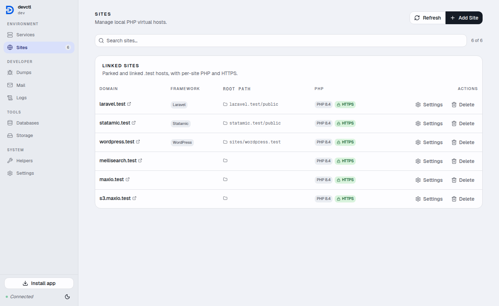

**Per-site controls:**

- Assign a PHP version (each site can run a different version)
- Enable or disable the SPX profiler
- Toggle HTTPS
- Toggle CORS header injection (disable when the app manages its own CORS, e.g. Laravel embed routes). Service reverse-proxy hosts (`s3.maxio.test`, `meilisearch.test`, `reverb.test`, …) always enable CORS so browser clients on other `*.test` origins can call them.
- Set a custom public directory

**TLS:** Caddy's internal CA generates certificates automatically. To eliminate browser warnings, trust the CA with:

```sh
sudo devctl elevate trust
```

(Requires the daemon + Caddy to be running so the CA can be read.)

**Framework detection:** devctl inspects `composer.json` and common project files to detect Laravel, Statamic, WordPress (classic and Bedrock), Drupal, Craft CMS, Symfony, and generic PHP projects.

---

## Git Worktrees

Any git-backed site can have worktrees added from the dashboard or the CLI. Pick or create a branch, optionally configure which paths to copy or symlink from the parent, and create the worktree.

The worktree is created as a sibling directory (`~/sites/myapp-feature-x/`) and immediately gets its own Caddy vhost. Open it like any other site: visit `https://myapp-feature-x.test`, or click the domain on the worktree card.

**Domain naming:** `{parent-dir}-{branch-slug}.test`. Branch slugging: lowercase; `/`, `_`, `.`, and other non-alphanumerics become `-`; `origin/` is stripped (`origin/my-branch` → `myapp-my-branch.test`). Example: parent dir `myapp`, branch `feature/auth` → `https://myapp-feature-auth.test`.

**Shared resources:** `vendor/` and `node_modules/` are **copied** (reflinked when the filesystem supports it), never symlinked. PHP resolves `__DIR__` through symlinks, so a symlinked `vendor/` makes Composer load classes from the parent checkout. If `composer.lock` (or the JS lockfile) differs from the parent, that directory is skipped so you can `composer install` / `npm install` for the branch.

`.env` (or `.env.example`) is copied and the parent hostname is rewritten to the worktree vhost (`APP_URL`, `SESSION_DOMAIN`, `SANCTUM_STATEFUL_DOMAINS`, WordPress `WP_HOME` / `WP_SITEURL`, Drupal `$base_url`, …). `DB_DATABASE` is left pointing at the parent database so worktrees share data by default.

| Project type | Copied from parent | Symlinked from parent |
|---|---|---|
| Laravel / Statamic / Symfony | `.env`, `vendor`, `node_modules` (`.env.local` for Symfony) | — |
| WordPress (classic + Bedrock) | `.env`, `wp-config.php`, `vendor`, `node_modules` | `wp-content/uploads`, `web/app/uploads` |
| Drupal | `.env`, `vendor`, `node_modules` | `web/sites/default/files`, `sites/default/files` |
| Craft CMS | `.env`, `.env.php`, `vendor`, `node_modules` | `web/cpresources` |
| Generic | `.env`, `vendor`, `node_modules` | — |

Missing sources are skipped. Check **Save as default for this site** (or `devctl sites:worktree:config`) to persist symlink/copy paths.

```sh
devctl sites:worktree:add myapp.test feature/auth
devctl sites:worktree:add myapp.test hotfix/now --create
devctl sites:worktree:add --json . feature/x          # domain, id, or path (`.` = cwd)
devctl sites:worktrees myapp.test
devctl sites:worktree:rm myapp-feature-auth.test
```

**Worktree cards** on the Sites page show a dashed border, a parent-site link, and the branch name. The parent card shows an active-worktree count badge.

**Remove a worktree** via its **Remove worktree** button or `devctl sites:worktree:rm` — this deletes the directory, prunes the git worktree entry, and removes the Caddy vhost.

**Auto-detection:** Worktree directories that appear in your watch folder via `git worktree add` in the terminal are auto-discovered, recognised by their `.git` file pointer, linked to their parent site, and seeded with the same copy/symlink/env rewrite pipeline.

---

## PHP Dumps (`php_dd`)

devctl injects `auto_prepend_file = {serverRoot}/devctl/prepend.php` into every installed PHP version's FPM ini. This makes a `php_dd()` helper available in all your sites without any configuration.

Calling `php_dd()` sends a serialised variable dump over TCP to devctl's dump receiver (default port `9912`), which displays it in the **Dumps** tab in real time.

```php
php_dd($someVariable);         // displays in the Dumps tab
php_dd($a, $b, $c);            // multiple args shown together
dd($someVariable);             // alias — works the same way
```

No browser extension, no Xdebug, no configuration required.

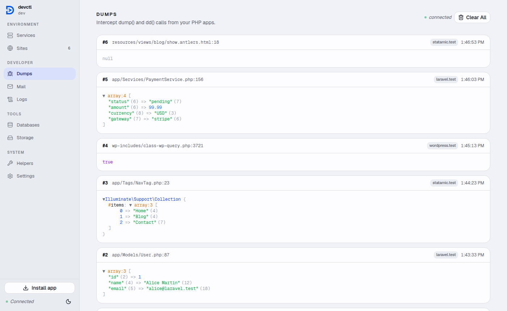

---

## SPX Profiler

devctl includes native support for [SPX](https://github.com/NoiseByNorthwest/php-spx), a low-overhead PHP profiler. SPX is compiled directly into devctl's custom PHP binaries (available for PHP 8.1–8.5, x86_64). It has zero overhead when not actively profiling. Legacy PHP 7.x / 8.0 builds ship without SPX.

### Enabling SPX for a site

1. Open a site's settings dialog (gear icon on the site card).
2. Toggle **SPX Profiling** on and save. devctl rewrites the PHP-FPM ini and restarts the pool.

Once enabled, the **Profiler** navigation item appears in the sidebar.

### Triggering a profile

Activate profiling for a specific request by sending the `SPX_ENABLED=1` and `SPX_KEY=dev` cookies, or as query parameters:

```
https://mysite.test/some/page?SPX_ENABLED=1&SPX_KEY=dev
```

The profile is saved to `{serverRoot}/php/{version}/spx-data/` and appears in the Profiler tab automatically.

### Profiler views

| Tab | Description |
|---|---|
| Flat Profile | Sorted table of all called functions with exclusive/inclusive time and call count |
| Flamegraph | SVG call stack visualization — hover for details, colour by call depth |
| Timeline | Chronological call timeline with function name labels |
| Metadata | Request URL, duration, peak memory, and other profiler metadata |

Profiles can be cleared from the UI at any time.

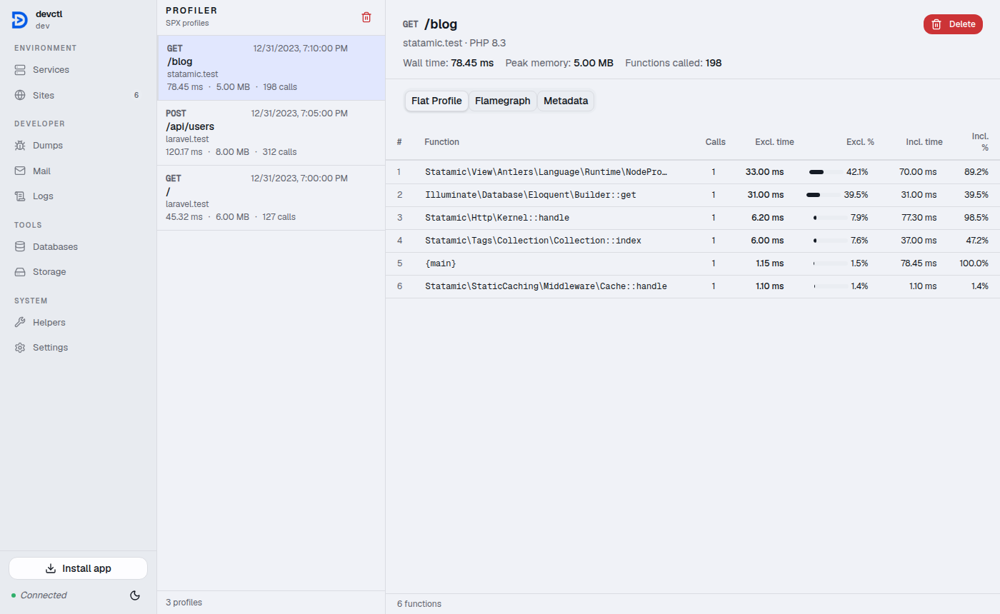

---

## Mail

Mailpit provides a local SMTP server and web UI for catching all outbound email from your PHP sites.

- **SMTP**: `127.0.0.1:1025` — configure your app's `MAIL_HOST` / `MAIL_PORT` to this address
- **Web UI**: `http://127.0.0.1:8025` — or click the **Mail** link in the devctl sidebar
- **Storage**: emails are stored at `{serverRoot}/mailpit/data/`

For Laravel, set in your `.env`:

```env
MAIL_MAILER=smtp
MAIL_HOST=127.0.0.1
MAIL_PORT=1025
```

Mailpit is configured via `MP_*` environment variables in `{serverRoot}/mailpit/config.env`. Click the file icon on the Mailpit row in the Services tab to edit this file directly.

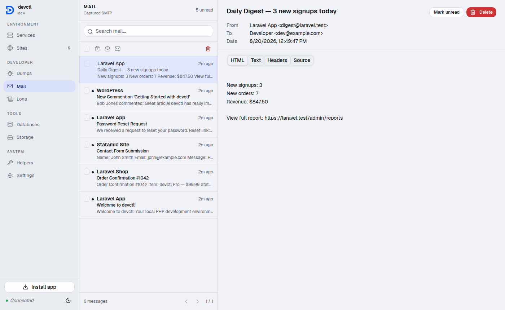

---

## Config Editor

Every config-enabled service has a file icon in the Services tab that opens a full-screen config editor powered by CodeMirror 6.

**Features:**

- Syntax highlighting and line numbers
- Ctrl+F in-editor search
- **Save & Restart** button — writes the file and restarts the service in one click
- Ctrl+S keyboard shortcut for Save & Restart

**Config-enabled services:**

| Service | Config file(s) |
|---|---|
| Valkey | `valkey.conf` |
| MySQL | `my.cnf` |
| Meilisearch | `config.toml` |
| Typesense | `typesense.ini` |
| Mailpit | `config.env` |
| ClickHouse | `config.xml`, `users.xml` (two tabs) |
| PHP-FPM | `php.ini`, `php-fpm.conf` (two tabs) |

---

## Logs

The **Logs** tab streams the tail of any service log file directly in the browser. Select a log from the left-hand list to open it in the viewer pane.

- All service logs are stored under `{serverRoot}/logs/` and listed automatically.
- The viewer streams new lines in real time via SSE — no manual refresh needed.
- **Clear** truncates the selected log file to zero bytes.
- On mobile, the list and viewer are separate panes with a back button.

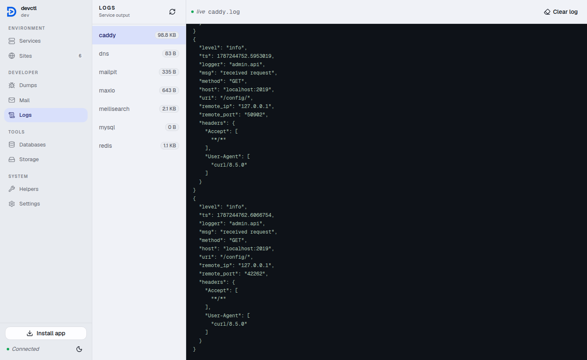

---

## Browser Notifications

devctl fires native desktop notifications when events occur while you are on another tab.

| Event | Behaviour |
|---|---|
| New `php_dd()` dump | Fires when you are not on the Dumps page. Multiple dumps within 1.5 s are collapsed into one count notification. Clicking navigates to that dump. |
| New email | Fires when you are not on the Mail page. Bursts are collapsed. Clicking navigates to the Mail page. |

Notification permission is requested automatically on first load. devctl uses the **Service Worker Notification API** when supported, with a direct `Notification` API fallback for browsers without service worker support.

## PWA (Install as an App)

The devctl dashboard is a Progressive Web App. Chrome and Edge will show an **Install app** button at the bottom of the sidebar when the PWA criteria are met. Clicking it installs devctl as a standalone desktop app — no browser chrome, its own window and taskbar entry, and the devctl icon in your launcher.

Installed assets:

| Asset | Details |
|---|---|
| App icon | 192×192 and 512×512 PNG icons, plus maskable variants for Android adaptive icon support |
| Apple touch icon | 180×180 PNG, used when adding to an iOS home screen |
| Theme colour | `#2563eb` (devctl blue) — colours the Android/Chrome address bar |
| Display mode | `standalone` — hides browser chrome when installed |

The service worker registers automatically on first load. It has no caching strategy (devctl is a local-only tool — offline support is unnecessary) but satisfies the browser's PWA installability criteria with proper `install` and `activate` lifecycle events.

---

## Elevation

Day-to-day devctl runs as your user under a systemd **system** unit with:

- `User=` / `Group=` set to your site user
- `AmbientCapabilities=CAP_NET_BIND_SERVICE` so supervised Caddy can bind ports 80/443 without `setcap` on the Caddy binary (and without re-elevating after Caddy updates)

One-shot privileged OS setup uses **typed elevate targets** (sudo only for these):

```sh
sudo devctl elevate              # trust + resolver + ports (default)
sudo devctl elevate trust        # install Caddy local CA into the system trust store
sudo devctl elevate resolver     # systemd-resolved drop-in for *.test
sudo devctl elevate ports        # write/refresh unit with User= + AmbientCapabilities
sudo devctl elevate install      # unit + enable + apt allowlist deps + resolver
sudo devctl unelevate            # reverse trust + resolver (+ strip ambient from unit)
devctl elevate:status            # no root — show which targets are configured
```

Under the hood, `sudo devctl elevate` re-invokes `devctl helper <op>` for each audited operation (frozen argv, euid 0 only). The long-lived daemon **refuses to run as root**.

Self-update and API restart re-exec the process in place — **no sudo** after an update.

---

## CLI

The devctl binary doubles as a CLI that talks to the running daemon at `127.0.0.1:4000` (or `$DEVCTL_ADDR`). Day-to-day commands work without root; only `elevate` / `unelevate` / `install` / `uninstall` need sudo.

```sh
devctl services:list              # list all services and status
devctl services:install mailpit   # install an available service
devctl services:restart caddy     # restart a service
devctl sites:list                 # list all sites
devctl sites:php myapp.test 8.4   # switch PHP version for a site
devctl sites:worktree:add myapp.test feature/auth  # new worktree + vhost
devctl logs:tail caddy --follow   # stream the tail of a log live
devctl mail:list                  # list captured emails
devctl settings:get               # show all settings
devctl settings:set devctl_port=4001  # change a setting (key=value)
devctl helpers:list               # list installed CLI helpers
devctl helpers:install mago       # download mago into the shared bin dir
devctl php:settings               # show PHP ini settings
devctl php:set memory_limit=512M  # update a PHP ini setting
devctl dns:status                 # check systemd-resolved DNS setup
devctl dumps:list                 # list recent php_dd() dumps
devctl spx:profiles               # list recent SPX profiler captures
sudo devctl elevate trust         # trust Caddy's internal CA (privileged)
devctl elevate:status             # show elevate targets
devctl devctl:update              # check for devctl updates and apply
devctl devctl:skill               # generate an OpenCode CLI skill file
```

### Global flags

| Flag | Description |
|---|---|
| `--json` | Output raw JSON instead of formatted text (works on every command) |
| `--addr=host:port` | Override the daemon address (default: `127.0.0.1:4000`, or `$DEVCTL_ADDR`) |
| `--help` | Show help for a specific command |

### Available commands

| Namespace | Command | Description |
|---|---|---|
| `services` | `services:list` | List all managed services and their status |
| | `services:available` | List services that can be installed |
| | `services:install <id>` | Install an available service |
| | `services:start <id>` | Start a stopped service |
| | `services:stop <id>` | Stop a running service |
| | `services:restart <id>` | Restart a service |
| | `services:update <id>` | Update an installed service to the latest version |
| | `services:credentials <id>` | Show connection credentials for a service |
| `sites` | `sites:list` | List all managed sites |
| | `sites:get <domain>` | Show full details for a site |
| | `sites:php <domain> <version>` | Switch the PHP version for a site |
| | `sites:spx <domain> enable\|disable` | Enable or disable the SPX profiler for a site |
| | `sites:cors <domain> enable\|disable` | Enable or disable Caddy CORS header injection for a site |
| | `sites:branches <domain>` | List git branches for a site |
| | `sites:worktrees [domain]` | List worktrees for a site, or every worktree |
| | `sites:worktree:add <domain> <branch>` | Create a worktree site (copy vendor/.env, rewrite URLs) |
| | `sites:worktree:rm <domain>` | Remove a worktree (git + directory + vhost) |
| | `sites:worktree:config <domain>` | Show or save default copy/symlink paths |
| `helpers` | `helpers:list` | List installed CLI helpers and versions |
| | `helpers:available` | List helpers that can be installed |
| | `helpers:install <id>` | Download and install a helper |
| | `helpers:update <id>` | Update a helper to the latest version |
| | `helpers:uninstall <id>` | Remove an installed helper |
| `php` | `php:versions` | List installed PHP versions and their FPM status |
| | `php:settings` | Show current PHP ini settings (applies to all versions) |
| | `php:set <key=value>...` | Update PHP ini settings |
| `postgres` | `postgres:extensions` | List managed PostgreSQL extensions and status |
| | `postgres:extensions:ensure` | Install missing extension files and wire SQL objects |
| `logs` | `logs:list` | List available log files |
| | `logs:tail <id> [--bytes=N] [--follow]` | Show the tail of a log file; `--follow` streams live |
| | `logs:clear <id>` | Clear (truncate) a log file |
| `dumps` | `dumps:list [--domain=]` | List recent php_dd() variable dumps |
| | `dumps:clear` | Delete all php_dd() dumps |
| `spx` | `spx:profiles [--domain=]` | List recent SPX profiler captures |
| | `spx:profile <key>` | Show CPU hotspot functions for an SPX profile |
| `mail` | `mail:list [--limit=N]` | List recent emails captured by Mailpit |
| | `mail:get <id>` | Show the full content of an email |
| | `mail:delete <id>[,<id>...]` | Delete one or more emails by ID |
| | `mail:clear` | Delete all emails from Mailpit |
| `dns` | `dns:status` | Check whether systemd-resolved is configured for `*.test` |
| | `dns:setup` | Configure systemd-resolved (or returns `needs_elevation` → use `elevate resolver`) |
| | `dns:teardown` | Remove the systemd-resolved `*.test` DNS configuration |
| `tls` | `tls:trust` | Trust Caddy's internal CA (prefer `sudo devctl elevate trust`) |
| `elevate` | `elevate [target]` | Grant OS privileges: `trust`, `resolver`, `ports`, `install` (requires sudo) |
| | `unelevate [target]` | Reverse elevate targets (requires sudo) |
| | `elevate:status` | Show which elevate targets are configured |
| `settings` | `settings:get` | Show all devctl settings |
| | `settings:set <key=value>...` | Update devctl settings |
| `devctl` | `devctl:update` | Check for a newer devctl release and update if one is available |
| | `devctl:skill` | Generate an OpenCode agent skill describing all CLI commands |

### OpenCode integration

Run `devctl devctl:skill` once to write an OpenCode skill file to `~/.agents/skills/devctl-cli/SKILL.md`. The daemon silently regenerates the file on every startup if it already exists.

---

## Ports

All ports bind to `127.0.0.1` by default (loopback only). Ports marked configurable can be changed from the Settings tab.

| Port | Service | Configurable |
|---|---|---|
| `127.0.0.1:4000` | devctl dashboard | Yes — Settings → Dashboard |
| `:80` / `:443` | Caddy | No |
| `127.0.0.1:2019` | Caddy Admin API | Yes — Settings |
| `127.0.0.1:5354` | DNS server (UDP+TCP) | Yes — Services → DNS → Settings |
| `127.0.0.1:9912` | PHP dump receiver (TCP) | Yes — Settings → PHP Dump Server |
| `127.0.0.1:6379` | Valkey | No |
| `127.0.0.1:5432` | PostgreSQL | No |
| `127.0.0.1:3306` | MySQL | No |
| `127.0.0.1:7700` | Meilisearch | No |
| `127.0.0.1:8108` | Typesense | No |
| `127.0.0.1:8025` | Mailpit web UI | Yes |
| `127.0.0.1:1025` | Mailpit SMTP | Yes |
| `127.0.0.1:7383` | Laravel Reverb | No |
| `127.0.0.1:9900` | MaxIO S3 API | No |
| `127.0.0.1:8123` | ClickHouse HTTP | No |
| `127.0.0.1:9000` | ClickHouse native TCP | No |

---

## Data Paths

All devctl runtime data lives under `{serverRoot}`, which defaults to `{sitesDir}/server` (e.g. `~/sites/server`). The sites directory is chosen during `devctl install` and stored in the SQLite database.

`{serverRoot}` is set in the systemd unit as `DEVCTL_SERVER_ROOT` and is the single source of truth — it is never hardcoded.

| Path | Contents |
|---|---|
| `{serverRoot}/devctl/devctl.db` | SQLite database (sites, settings, dumps) |
| `{serverRoot}/devctl/prepend.php` | PHP auto-prepend for `php_dd()` |
| `{serverRoot}/devctl/devctl` | devctl binary (default install location) |
| `{serverRoot}/bin/` | Shared bin dir on `PATH` — devctl symlinks and auto-downloaded tools (sqlite3, …) |
| `{serverRoot}/logs/` | Service log files (`caddy.log`, `dns.log`, `mysql.log`, …) |
| `{serverRoot}/caddy/` | Caddy binary, env file, internal CA data |
| `{serverRoot}/valkey/` | Valkey binary, `valkey.conf`, data |
| `{serverRoot}/postgres/` | PostgreSQL binary tarball, TimescaleDB extension files, `data/` directory |
| `{serverRoot}/mysql/` | MySQL binaries (extracted from `.deb`), `data/` directory |
| `{serverRoot}/meilisearch/` | Meilisearch binary, `config.toml`, index data |
| `{serverRoot}/typesense/` | Typesense binary, `typesense.ini`, data |
| `{serverRoot}/mailpit/` | Mailpit binary, `config.env`, email storage |
| `{serverRoot}/reverb/` | Laravel app that runs `php artisan reverb:start` |
| `{serverRoot}/maxio/` | MaxIO binary, `config.env`, object data |
| `{serverRoot}/clickhouse/` | ClickHouse binary, `config.xml`, `users.xml`, data |
| `{serverRoot}/php/{version}/` | PHP static binary, `php.ini`, `php-fpm.conf`, SPX data |
| `/etc/systemd/system/devctl.service` | Systemd unit file |
| `/etc/profile.d/devctl.sh` | Adds `{serverRoot}/bin` to `PATH` for all users |

---

## Contributing & Development

### Tech stack

| Layer | Choice |
|---|---|
| Backend | Go 1.25, stdlib `net/http` (no third-party router) |
| Database | SQLite (`modernc.org/sqlite`), sqlc (codegen), goose (migrations) |
| Frontend | Vue 3, TypeScript, Pinia, Vite 7, Tailwind CSS v4, shadcn-vue |
| Proxy / TLS | Caddy with internal CA, wildcard `*.test` certs |
| Service unit | systemd system service |

### Build commands

```sh
make dev          # go run . (backend only, no frontend rebuild)
make dev-ui       # Vite HMR dev server (frontend only)
make build        # build-ui + go build
make install      # build + install binary + systemd unit (requires root)
make sqlc         # regenerate db/queries/*.go from db/queries/*.sql
make db-migrate   # apply goose migrations to {serverRoot}/devctl/devctl.db
```

### Package layout

| Package | Responsibility |
|---|---|
| `main.go` | Entry point, subsystem wiring, graceful shutdown, update checker |
| `api/` | HTTP handlers, route registration (`api/server.go`), SSE, WebSocket |
| `services/` | Static service registry, exec manager, status poller, process supervisor |
| `sites/` | Site CRUD (SQLite), Caddy Admin API client, fsnotify watcher |
| `php/` | PHP-FPM version detection, install/uninstall, php.ini read/write |
| `dumps/` | TCP dump receiver, WebSocket broadcast hub, SQLite store |
| `install/` | Idempotent service installers — one file per service |
| `config/` | `config.Load()`, static default service definitions (`defaults.go`) |
| `paths/` | Single source of truth for all filesystem paths |
| `dnsserver/` | Built-in DNS server goroutine |
| `cli/` | CLI command registry, HTTP client, lipgloss output, per-namespace command files |
| `selfinstall/` | `devctl install` / `devctl uninstall` sub-commands |
| `db/` | SQLite open, goose migrations (`db/migrations/`), sqlc queries (`db/queries/`) |
| `frontend/` | Vue 3 SPA — `src/lib/api.ts` (all fetch wrappers), `src/stores/` (Pinia) |

### Key conventions

- **No third-party HTTP router** — use Go 1.22+ `METHOD /path/{param}` syntax in `net/http`.
- **No CGO** — `modernc.org/sqlite` is pure Go.
- **Frontend is embedded** in the binary via `//go:embed ui/dist`; run `make build-ui` before `go build` for a working UI.
- **All REST calls** in the frontend go through `frontend/src/lib/api.ts` — never call `fetch()` directly in components or stores.
- **Never hardcode paths** — always use the `paths` package or `DEVCTL_SERVER_ROOT`.
- The binary **requires root** — enforced at startup, logged to the systemd journal.

### Screenshots

The dashboard is fully responsive. On narrow viewports the sidebar collapses into a slide-in drawer and service lists switch to a card layout.

<p align="center">
  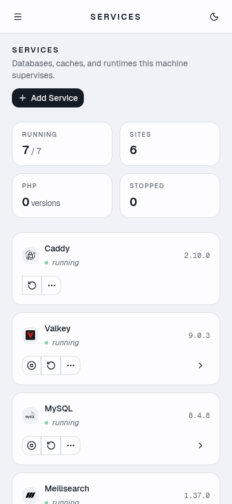
  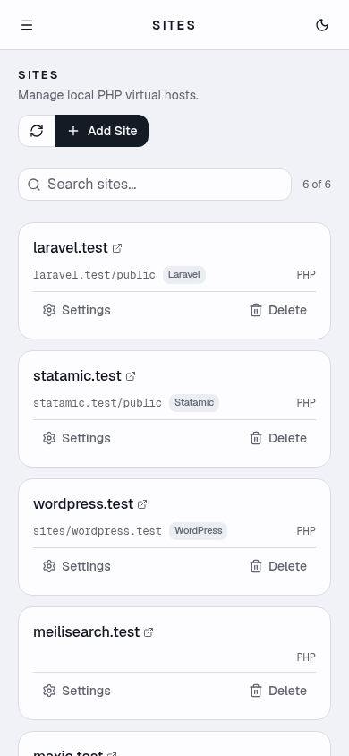
  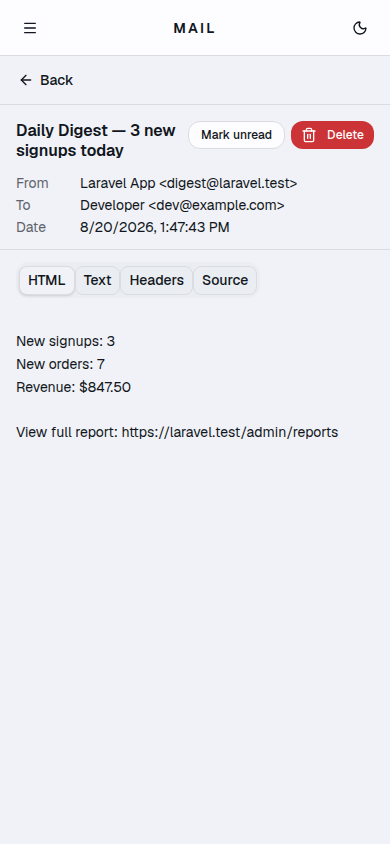
  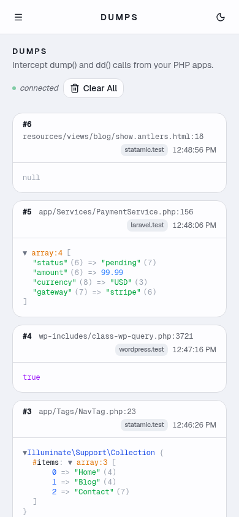
  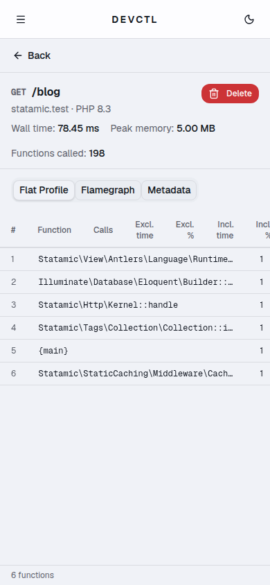
  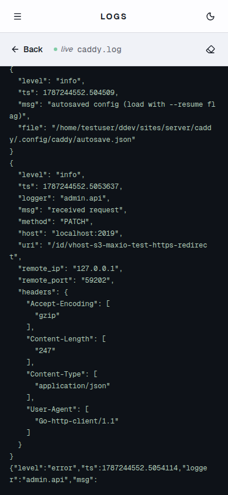
  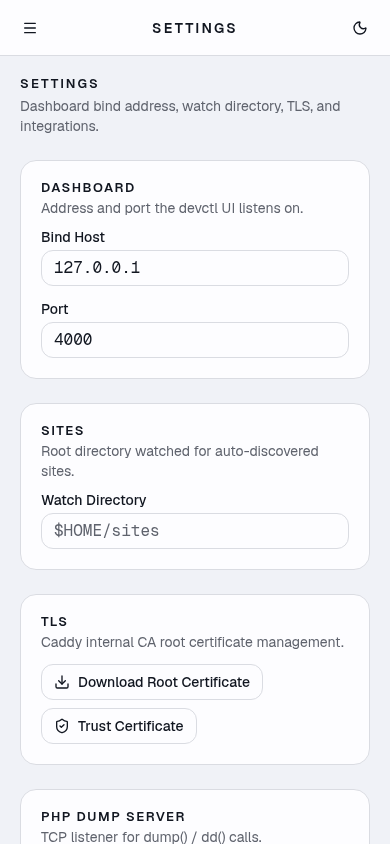
  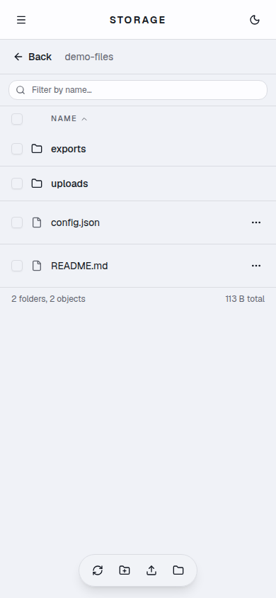
  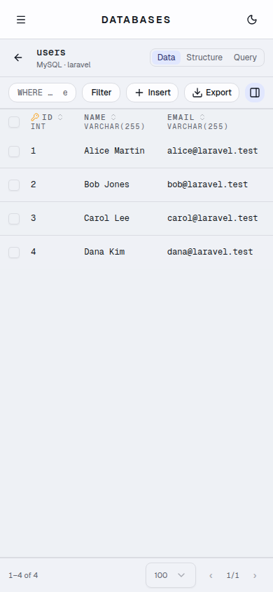
  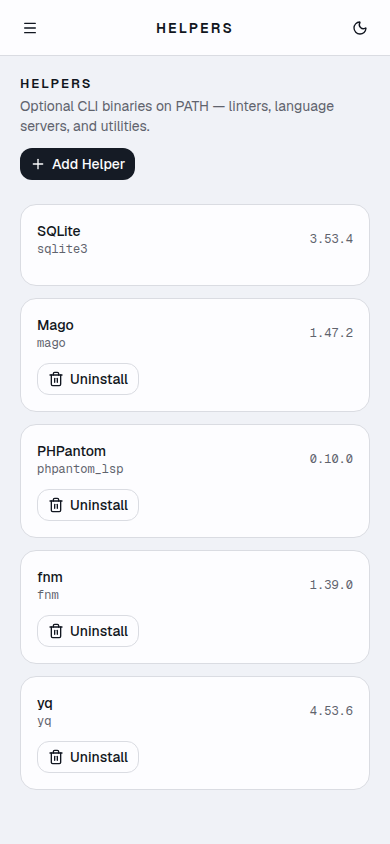
</p>

Additional screenshots:

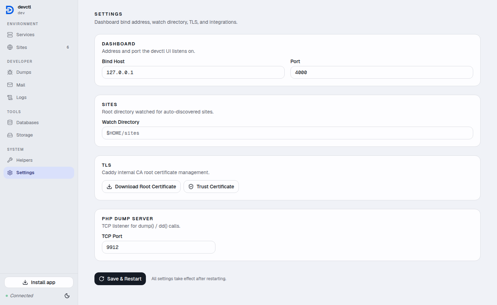

---

## License

MIT
